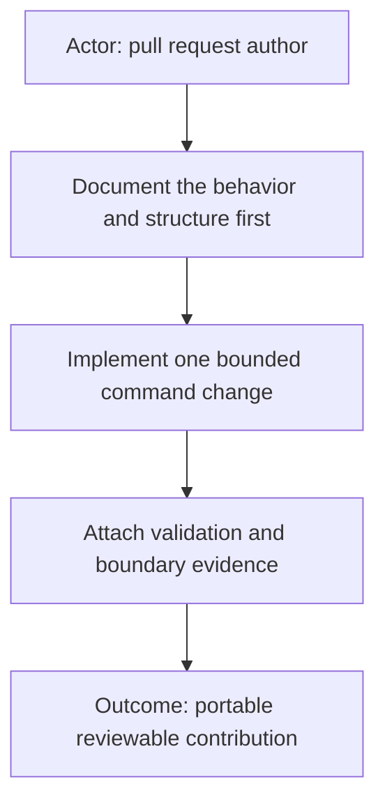

# AI Command contribution

**Purpose and scope**

<!-- What user-facing outcome does this PR provide? Keep the scope bounded. -->

**Command shape and layers**

<!-- Contract, executable, integrated, visual, or flow? Which contract, execution, configuration, or visual layers changed? -->

**Documentation-first evidence**

<!-- Link the diagrams, command contract, README, structure, and configuration examples updated before or with implementation. -->

**Validation**

<!-- List exact tests/checks and the important allowed and blocked paths covered. -->

**External effects and dependencies**

<!-- Providers, dependencies, migrations, generated artifacts, UI surfaces, or none. -->

**Contributor checklist**

- [ ] The purpose and scope are clear and limited to one command or shared convention.
- [ ] The branch name is short, purpose-based kebab case with no agent or tool attribution.
- [ ] Every substantive Markdown section starts with a compact `flowchart TD` diagram.
- [ ] Documentation and diagrams describe every changed behavior before or with the implementation.
- [ ] The command follows the documented folder structure, or this PR documents a reusable convention change.
- [ ] Executable behavior has proportionate tests and observable evidence.
- [ ] Configuration examples contain placeholders only; real credentials and local configuration are absent.
- [ ] No private identifiers, URLs, absolute local paths, generated output, or unrelated files are included.
- [ ] The contribution is understandable and testable without a private parent repository.
