# Contributing to AI Commands

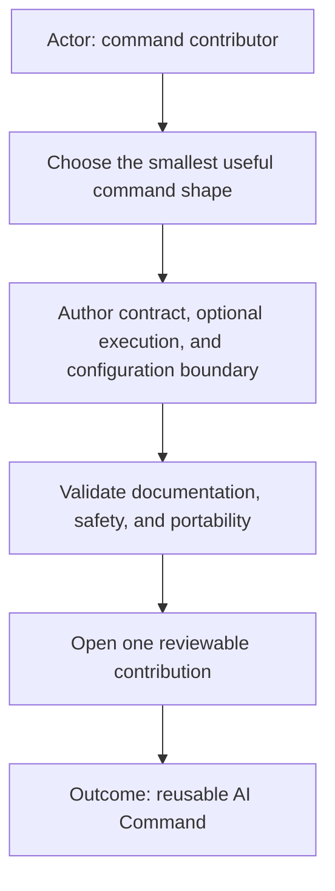

Thank you for helping build portable, executable skills. A contribution should
be understandable from its diagrams and Markdown before anyone runs its code.

## Current project context

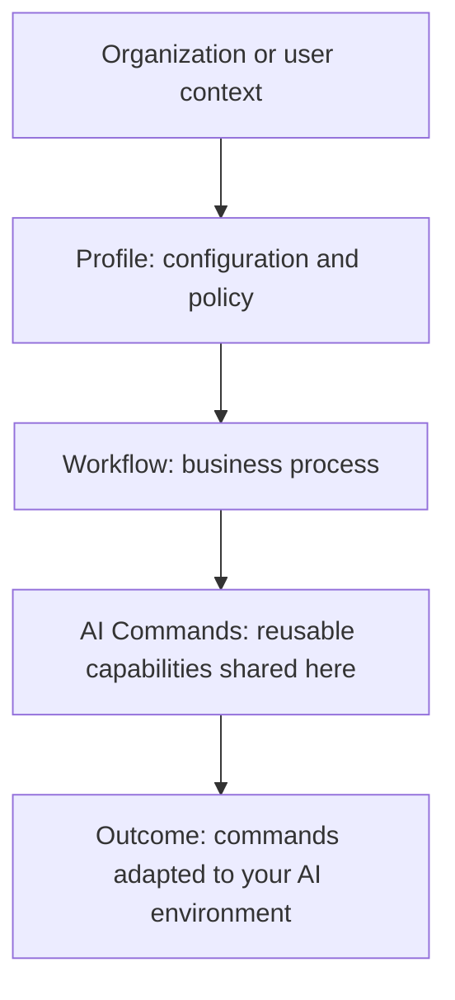

AI Commands are currently the open-source extraction shared from a larger
project. A **profile** can be understood as the configuration and policy for
your organization or user context. A **workflow** is whatever business or work
process uses the commands. Profiles and workflows are not published here yet;
the reusable Commands layer is what this repository currently shares.

You may use or adapt the commands in whichever AI environment you prefer. A
contribution may reference profile or workflow coordinates, but must keep the
command independently understandable and must not require unpublished parent
artifacts.

## Three-layer command model

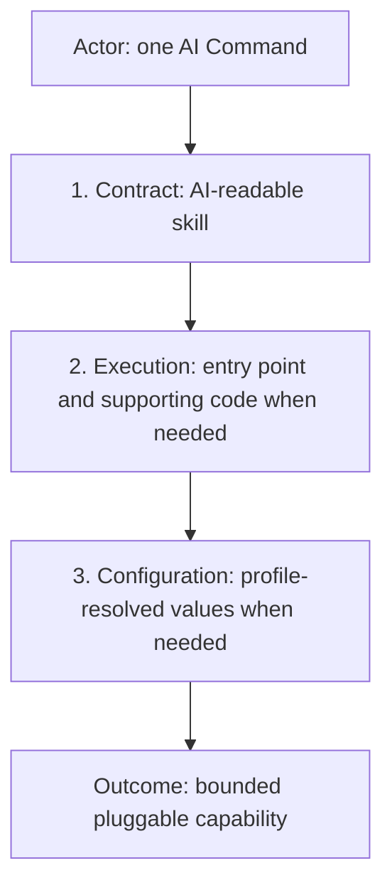

Every command begins with a `<name>.command.md` contract. A command that performs
deterministic work adds an executable entry point—usually
`<name>.command.sh`—and may use Python, JavaScript, TypeScript, or another
appropriate implementation language. A command that needs environment-specific
values defines a configuration contract resolved from the active profile or
local command configuration.

The three layers are conceptual, not mandatory empty files. A contract-only
command such as [`agents`](agents/README.md) intentionally needs no executable or
local configuration. Do not add stubs merely to imitate a larger command.

## Folder templates

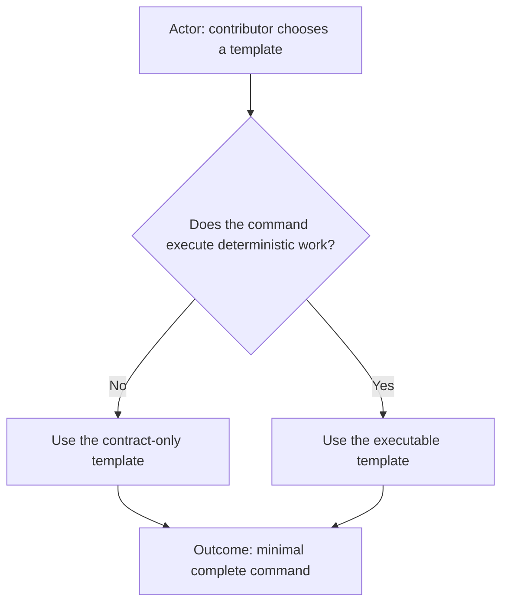

Contract-only:

```text
<name>/
├── README.md
└── <name>.command.md
```

Executable or integrated:

```text
<name>/
├── README.md
├── <name>.command.md
├── <name>.command.sh
├── <name>.command.example.conf
├── src/                         # optional Python, JS, TS, or other code
├── adapters/                    # optional provider-specific mechanics
├── test/
├── feature.yml                 # optional visual-feature metadata
├── app.sh                      # optional standalone UI entry point
└── launcher/                   # optional Electron or browser UI
```

Keep generated reports, installed dependencies, credentials, and real local
configuration out of version control.

## Contract layer

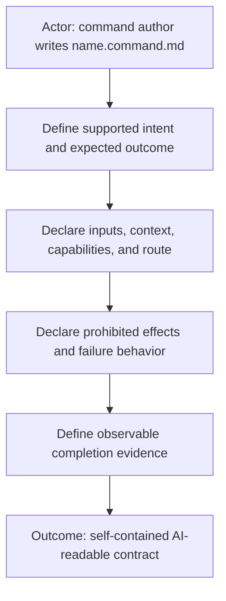

The contract is the source of truth. It should explain what the command means,
how natural-language intent maps to it, which context it consumes, what it may
change, what it must never do, and which evidence demonstrates completion.

Portable commands must not hardcode an organization, client, private repository,
credential, workflow team, or local filesystem path. External workflows and
profiles may narrow or extend the portable contract.

## Execution layer

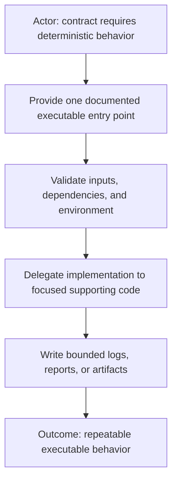

Prefer a small shell entry point for predictable invocation and environment
setup. Put substantial behavior in focused source files rather than one large
shell script. Choose the implementation language that fits the command.

Executables should support explicit project and output locations when relevant,
avoid writing surprising files into a repository root, and fail with actionable
messages when dependencies or authorization are missing.

## Configuration layer

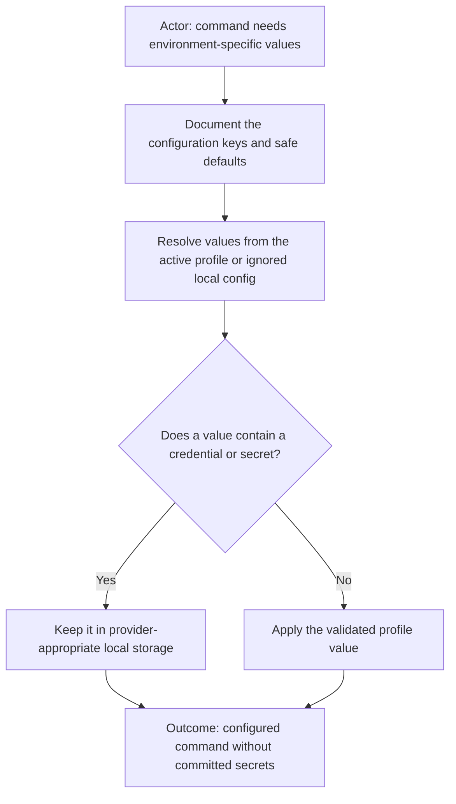

Publish `<name>.command.example.conf` only when a local configuration file is
useful. Use placeholders, never real credentials. Profile configuration should
select providers, policies, identities, URL patterns, or template references;
tokens and passwords belong in ignored credential stores.

Commands consume the supplied profile, workflow, and project coordinates. They
must not guess a profile from a company name, URL, current directory, or previous
conversation.

## Optional visual layer

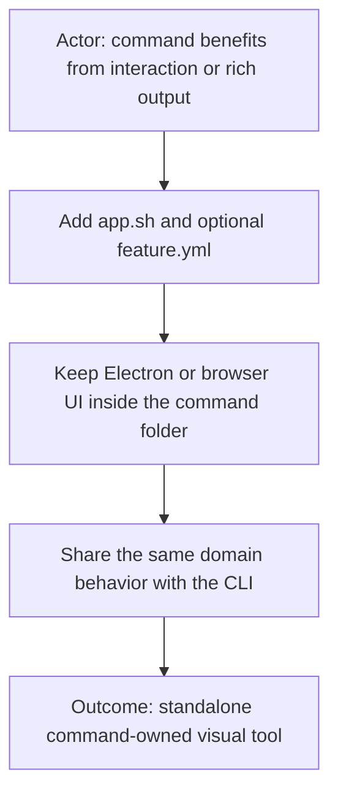

A visual command may provide an Electron application, browser page, interactive
report, preview, or progress view. The UI is an adapter over the same command
contract, not a separate source of behavior. Keep it runnable independently and
capable of accepting bounded context from a host launcher.

## Visual-first documentation

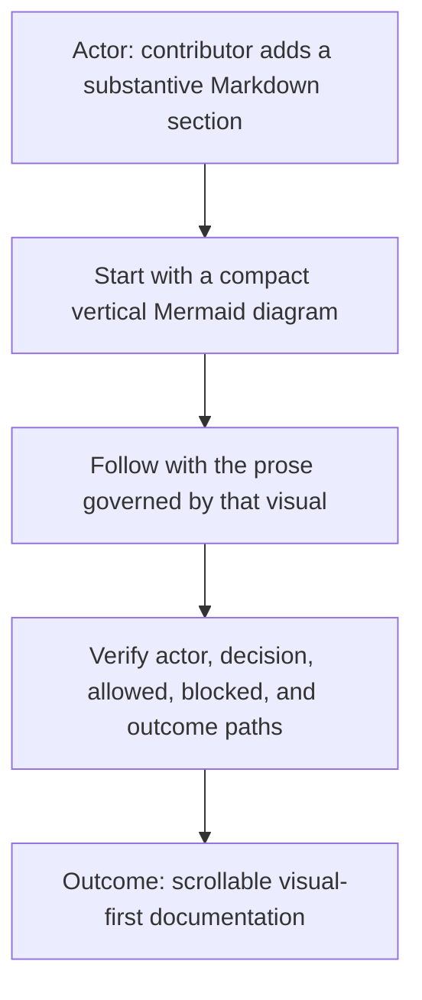

Every top-level and substantive section starts with a compact Mermaid
`flowchart TD`. Prefer short nodes that fit narrow screens. Put the diagram
before the explanatory paragraphs, keep its behavior consistent with the text,
and avoid uncovered normative rules.

Use diagrams for behavior, decisions, boundaries, lifecycle, or structure. Use
small text trees for literal folder layouts. Do not replace meaningful prose
with decorative diagrams.

## Contribution workflow

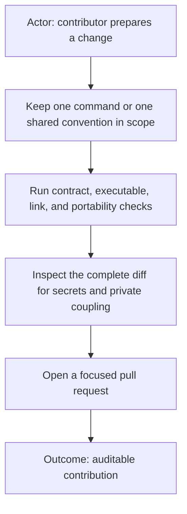

Keep pull requests focused. Include tests for deterministic behavior and safety
guards. Verify Markdown links and vertical diagrams. Search the final diff for
credentials, private URLs, organization names, local absolute paths, generated
reports, and unrelated files.

## Documentation-first delivery

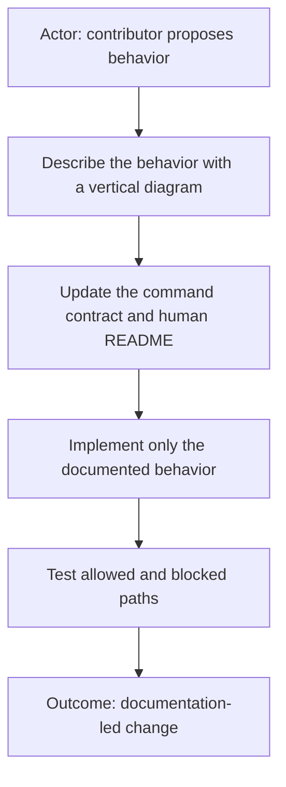

Behavior begins in documentation. Update the relevant visual, command contract,
human README, configuration example, and folder template before or together with
implementation. Code must not introduce an undocumented capability, provider,
mutation, route, configuration key, or UI behavior.

Documentation-first does not mean documentation-only. Executable changes still
need proportionate automated tests and observable evidence. A documentation
change that alters command behavior is a contract change and receives the same
safety review as code.

## Pull request contract

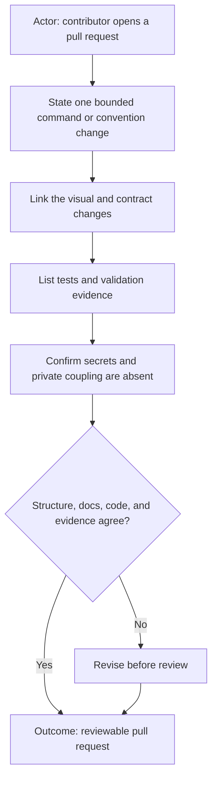

Every pull request must:

- explain the user-facing purpose and bounded scope;
- update diagrams and prose before or with changed behavior;
- preserve the command folder convention or explain a reusable convention
  change;
- identify the command shape and which contract, execution, configuration, or
  visual layers changed;
- list exact validation performed and important blocked paths covered;
- disclose external providers, dependencies, generated artifacts, and migration
  effects;
- confirm that credentials, real local configuration, private identifiers,
  absolute local paths, and unrelated files are absent;
- remain understandable and testable without access to a private parent
  repository.

Use the repository’s pull-request template. Draft pull requests may contain
incomplete implementation, but they must still describe the intended contract
and mark missing evidence honestly. Review approval is based on the complete
diff, not on claims in the description alone.

## Review checklist

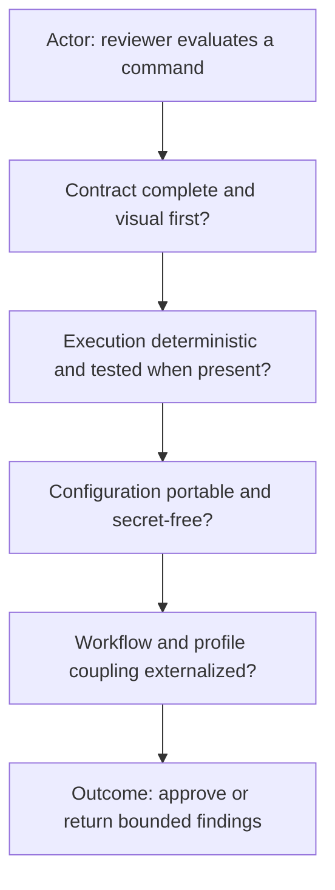

- [ ] The command has a concise human README and required command contract.
- [ ] Every substantive Markdown section begins with a vertical diagram.
- [ ] Optional executable, source, configuration, and UI files have a real need.
- [ ] Tests cover deterministic behavior and important blocked paths.
- [ ] No credentials, private identifiers, absolute local paths, or generated
      output are committed.
- [ ] Profile, workflow, and project coordinates are consumed rather than
      guessed.
- [ ] The change is self-contained and links resolve inside the repository.
