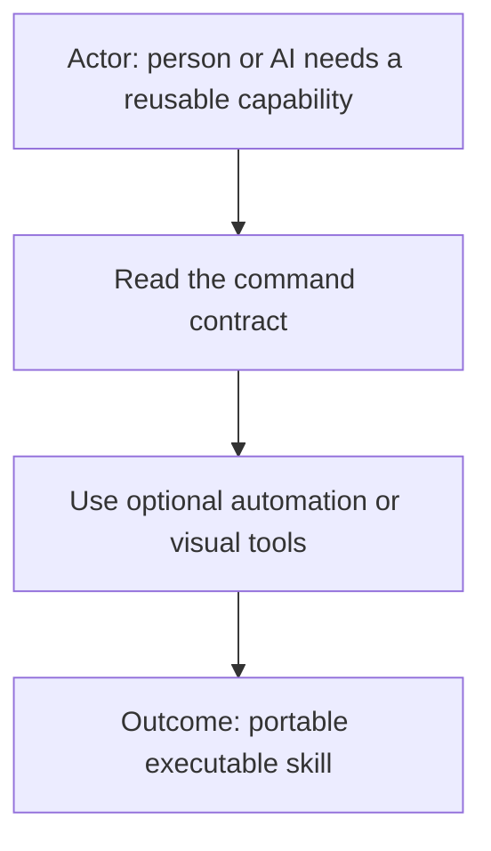
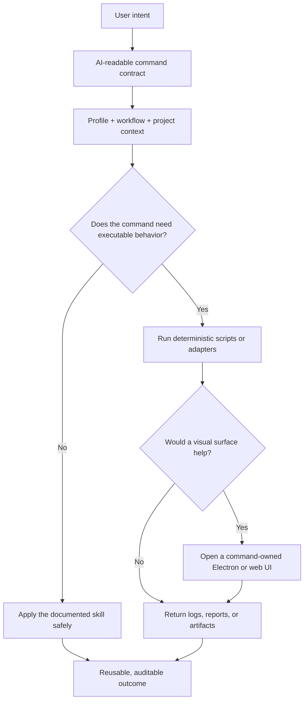
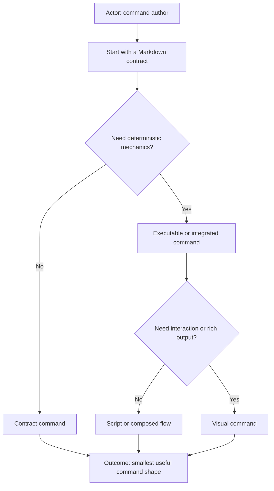
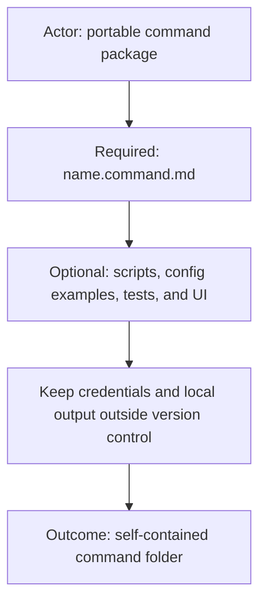
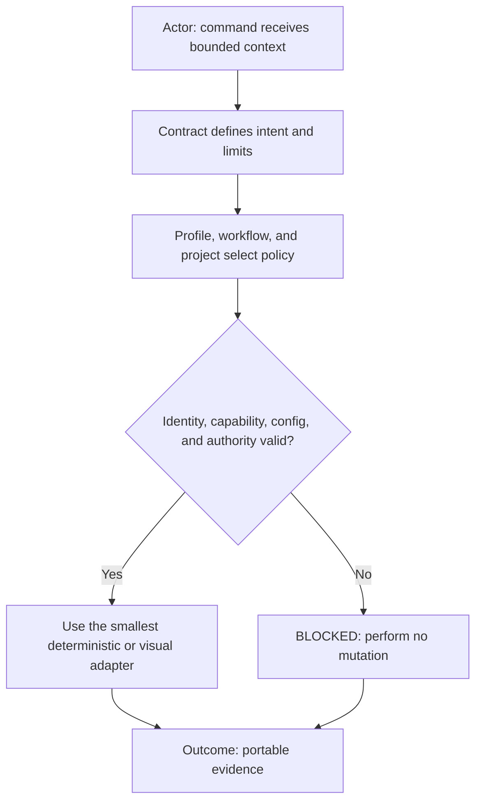
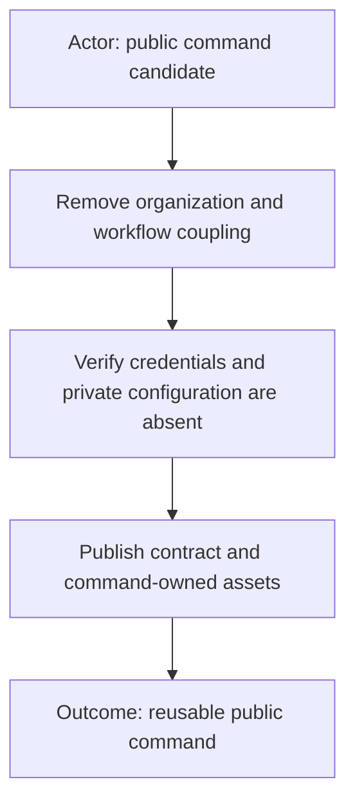
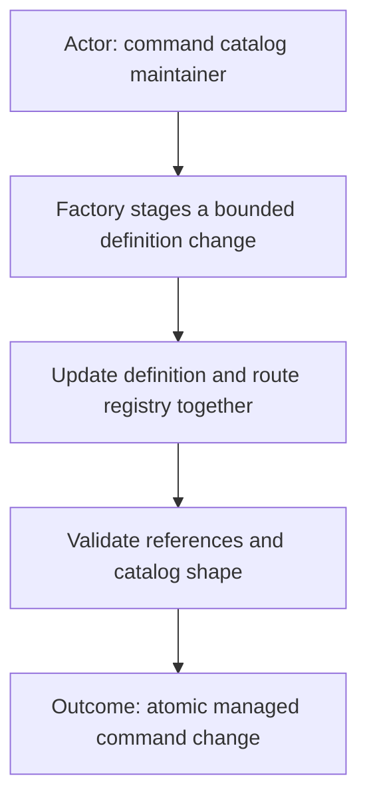
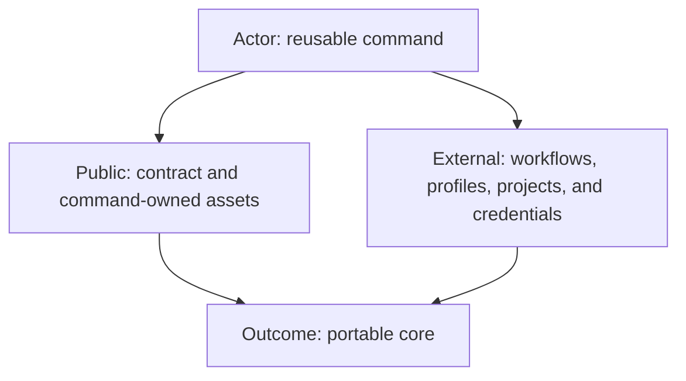
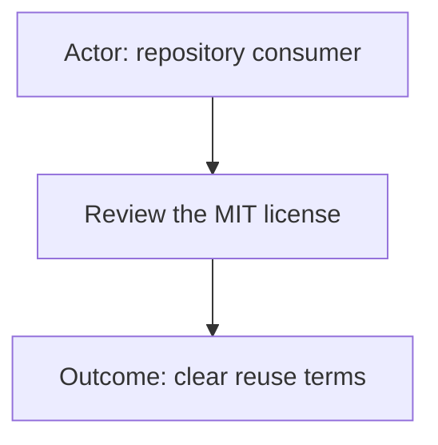

# AI Commands



**Pluggable executable skills for AI-assisted work.**

AI Commands combine human-readable guidance with optional deterministic
automation and visual tools. A command may be as small as one Markdown contract
or as capable as a self-contained feature application with scripts, tests,
reports, and an Electron or browser-based interface.

We call them **commands** because “skill” describes only part of the idea. They
can teach an AI how to perform a task, but they can also execute repeatable work,
validate the environment, produce evidence, and offer a purpose-built UI.

## What is an AI Command?



The Markdown contract remains the source of truth. Executables and interfaces
make appropriate parts deterministic or easier to use; they do not silently
replace the command’s declared behavior and safety boundaries.

## Command shapes



- **Contract** — Markdown guidance for reasoning, policy, routing, review, or
  coordination.
- **Executable** — a contract plus scripts for repeatable validation,
  transformation, setup, or reporting.
- **Integrated** — provider adapters and configuration templates for external
  systems such as Git or ticket trackers.
- **Visual** — a command-owned Electron or web UI for controls, previews,
  progress, file selection, or rich reports.
- **Flow** — composition of other commands into a multi-step, evidence-producing
  outcome.

A command can grow from one shape into another without changing its public
identity or forcing every installation to use the optional pieces.

## Portable structure



Only `<name>.command.md` is required. Everything else is optional and should be
added only when the command needs it.

```text
<name>/
├── README.md                    # concise human overview
├── <name>.command.md            # required AI-readable contract
├── <name>.command.sh            # optional executable entry point
├── <name>.command.example.conf  # optional safe configuration template
├── feature.yml                  # optional visual-feature metadata
├── app.sh                       # optional standalone UI launcher
├── launcher/                    # optional Electron or browser UI
├── adapters/                    # optional provider-specific mechanics
├── test/                        # optional contract and executable tests
└── reports/                     # optional local output; normally ignored
```

Local credentials and environment-specific configuration must never be
committed. Publish example configuration with placeholders and keep actual
values in ignored, provider-appropriate local storage.

## Design principles



- **Contract first.** Natural-language intent, inputs, boundaries, and expected
  evidence are readable before execution.
- **Deterministic where practical.** Scripts own repeatable mechanics,
  dependency checks, validation, and artifact production.
- **Context bound.** Profile, workflow, and project coordinates select policy
  and configuration without hardcoding a client into a portable command.
- **Fail closed.** Missing identity, capability, configuration, authorization,
  or route evidence blocks mutation.
- **UI optional.** Electron and web surfaces are adapters over the command, not
  a requirement for headless use.
- **Portable core, local integration.** Public commands stay reusable while
  private workflows and profiles extend them externally.

## Published commands



### [`agents`](agents/README.md)

Portable identity, capability, same-profile communication, and workflow-agent
lifecycle routing. It demonstrates a contract-only command with vertical
decision diagrams and strict profile isolation.

More commands will be published one at a time after their organization-specific
assumptions, credentials, and workflow coupling have been removed.

## Creating and managing commands



See [`CONTRIBUTING.md`](CONTRIBUTING.md) for the three-layer command model,
contract-only and executable folder templates, visual-first documentation rule,
configuration boundaries, and review checklist.

Command catalogs benefit from a small factory that creates, updates, renames,
and removes definitions together with their execution-route registry. The
factory should treat route names as opaque identifiers: workflows and external
policy decide what a route means and whether it is authorized.

The portable factory and registry package are being prepared separately. Until
they are published here, contributors should preserve the structure above and
review command additions as complete, self-contained changes.

## Repository boundary



This repository contains reusable command contracts and their command-owned
assets. Workflow definitions, organization profiles, project bindings,
credentials, and private configuration belong outside it. They may reference
and extend these commands without being included in this repository.

## License



[MIT](LICENSE)
