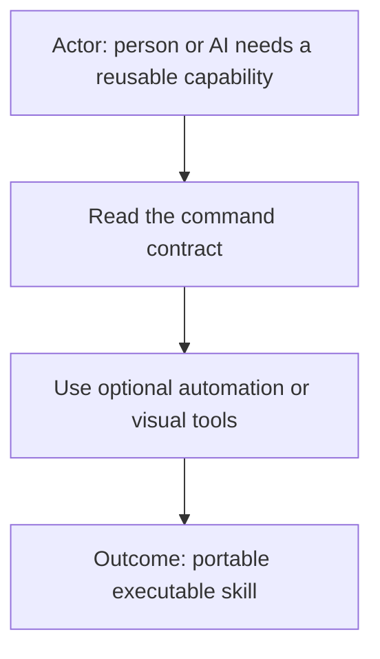

# AI Commands

> **Archived location:** This standalone repository is no longer the current source. AI Commands has moved to [AI Fleas](https://github.com/starodubtsevconsulting/ai-fleas/tree/main/ai-commands). Please use that location for current documentation and changes.

**Pluggable executable skills for AI-assisted work.**

AI Commands combine human-readable guidance with optional deterministic automation and visual tools. A command may be as small as one Markdown contract or as capable as a self-contained feature application with scripts, tests, reports, and an Electron or browser-based interface.

The contents below are retained for historical reference. The maintained version is now in AI Fleas.
