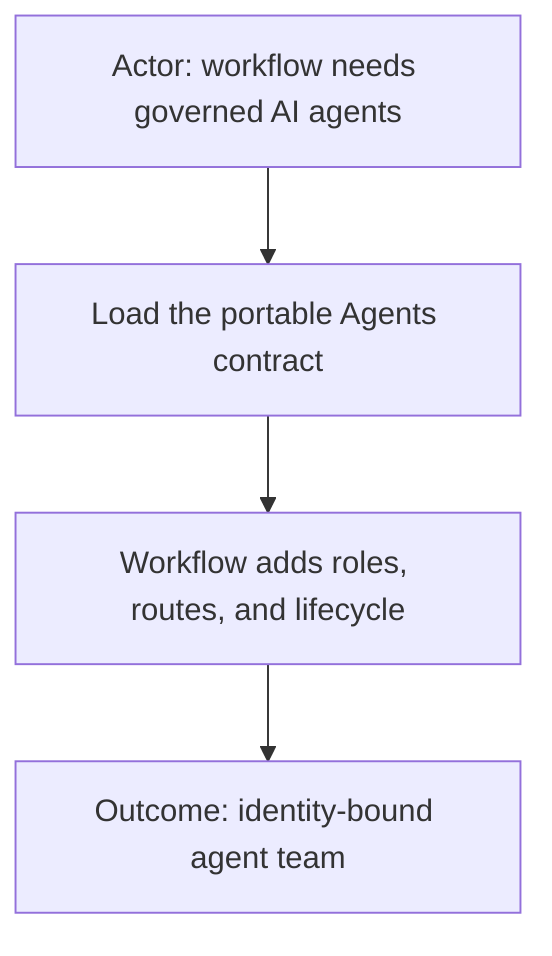
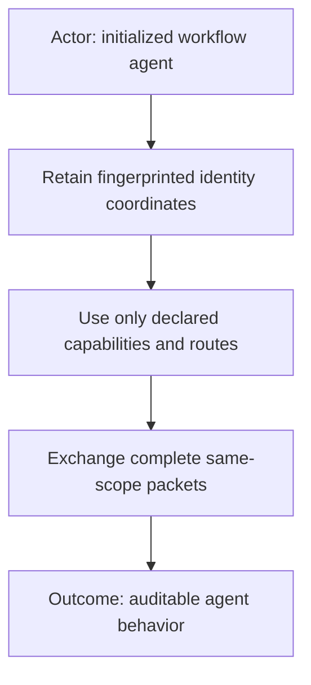
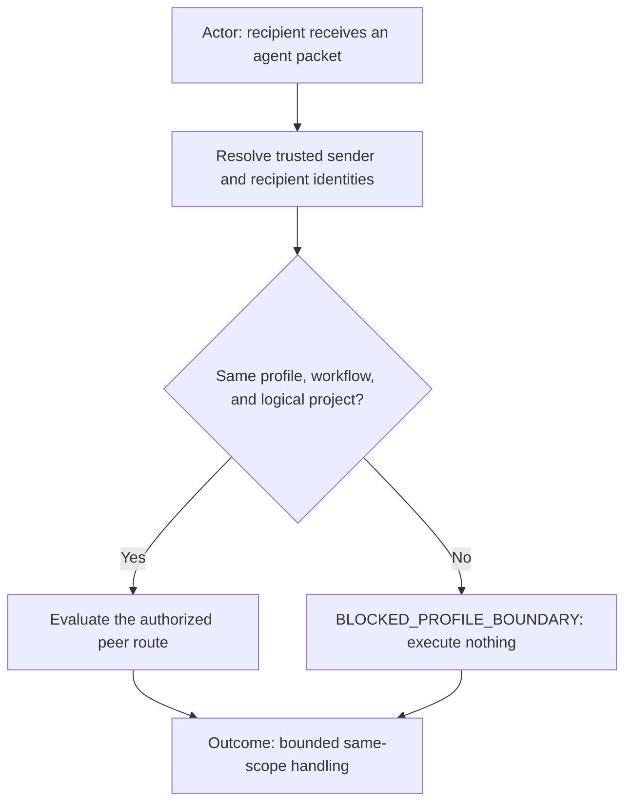
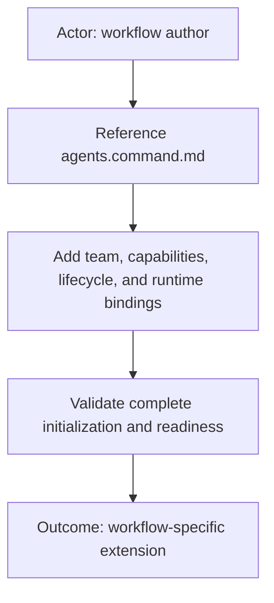
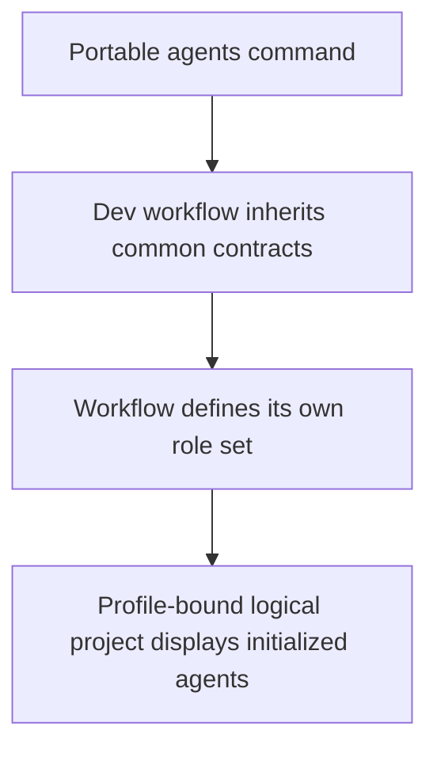
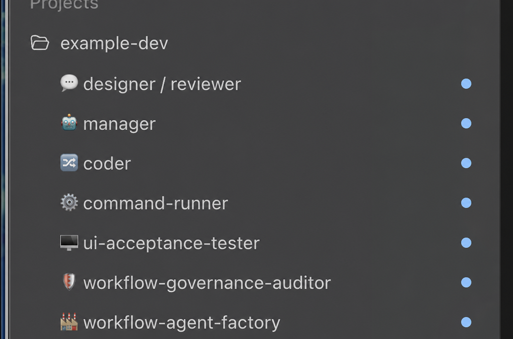
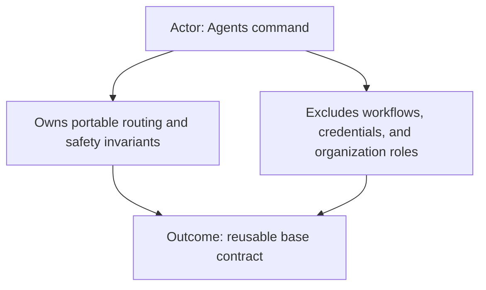

# Agents command

The `agents` command is a portable base contract for administering and
coordinating workflow-owned AI agents. It defines the invariants that workflows
can extend without embedding a particular company, profile, project, runtime,
or team structure.

## What it provides

- Explicit `profileId`, `workflowId`, and logical-project coordinates.
- Immutable, fingerprint-backed initialized agent identity.
- Same-profile peer communication with fail-closed boundary checks.
- Capability and route authorization independent of model or tool access.
- Portable initialization, reinitialization, archival, and inspection routing.
- Vertical Mermaid diagrams suitable for narrow documentation views.

## Profile isolation

Before processing an inter-agent payload, the recipient compares its trusted
initialized identity with the sender and return-task identities. All three must
belong to the same profile, workflow, and logical project. A mismatch returns
`BLOCKED_PROFILE_BOUNDARY` and performs no work.

For example, a Designer/Reviewer initialized for `<profile-a>-dev` cannot send
work to a Coder initialized for `<profile-b>-dev`, even though both use the
independent `dev` workflow.

## Integration

A workflow extends [`agents.command.md`](agents.command.md) with its own:

- role and team definitions;
- capability and communication topology;
- initialization payload and readiness tokens;
- lifecycle and runtime adapter;
- profile and project configuration bindings.

Those workflow-specific artifacts intentionally do not belong in this command.
Profiles contain policy references and non-secret identity expectations;
credentials stay in local, ignored, provider-appropriate storage.

## Workflow-context example

This sanitized runtime view illustrates one possible integration. The Dev
workflow inherits the generic identity, capability, same-scope communication,
and lifecycle-routing rules from the `agents` command, then supplies its own
roles and topology. The seven visible entries are an example, not a required
portable roster: another workflow may define one agent or a different team.

The logical project name combines a profile with the independent workflow. The
neutral `example-dev` label demonstrates that binding without embedding an
organization in this public command. A persistent workflow agent factory may
administer the workflow-owned agents while remaining outside the set it
reinitializes; that lifecycle choice belongs to the workflow, not this base
contract.

## Scope boundary

This command describes portable routing and safety contracts. It does not ship
a workflow, create runtime tasks itself, contain credentials, or define a
specific organization’s agents. It intentionally uses the contract-only
template from [`CONTRIBUTING.md`](../CONTRIBUTING.md), so it has no empty
executable or configuration stubs.
