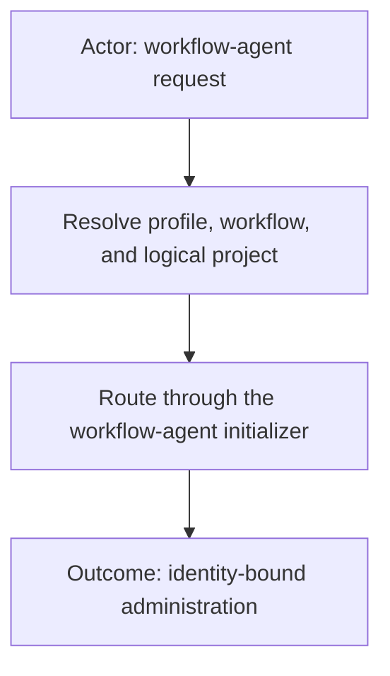
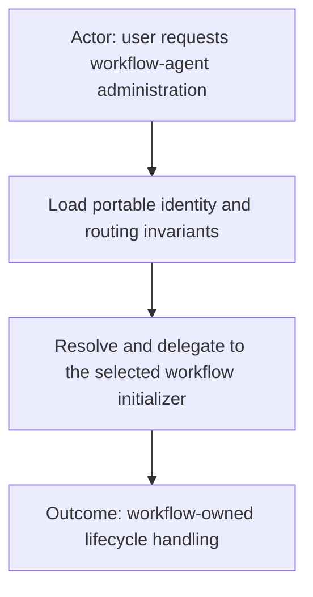
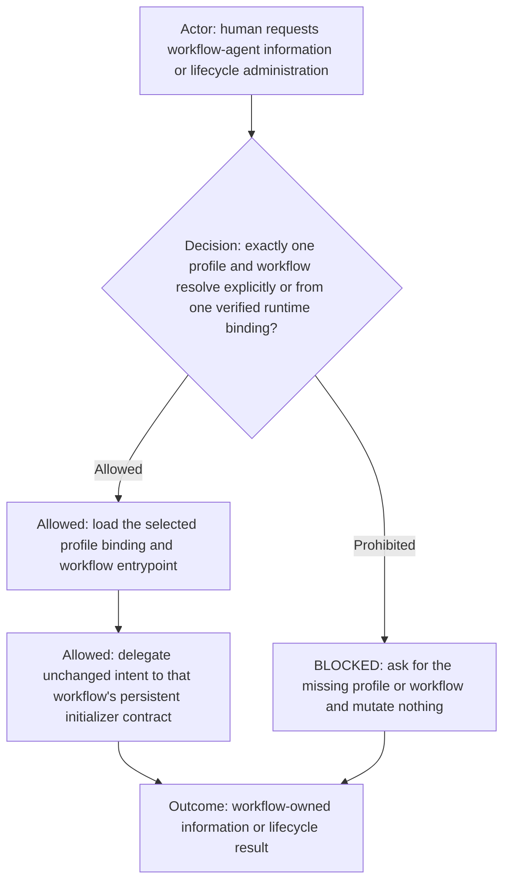
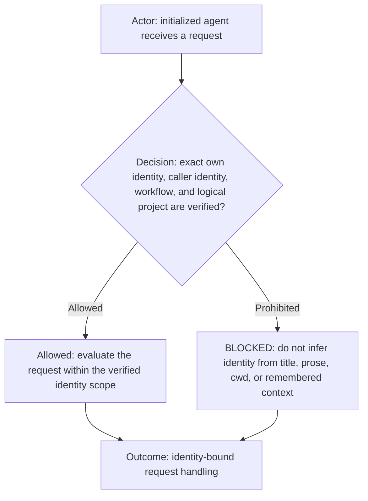
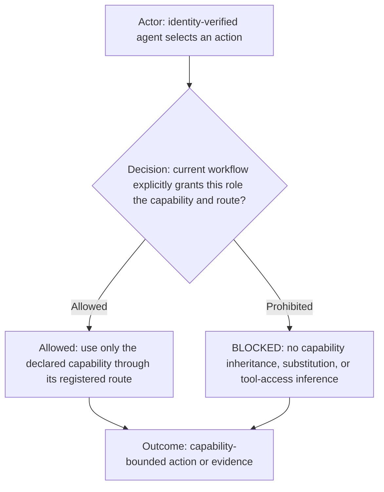
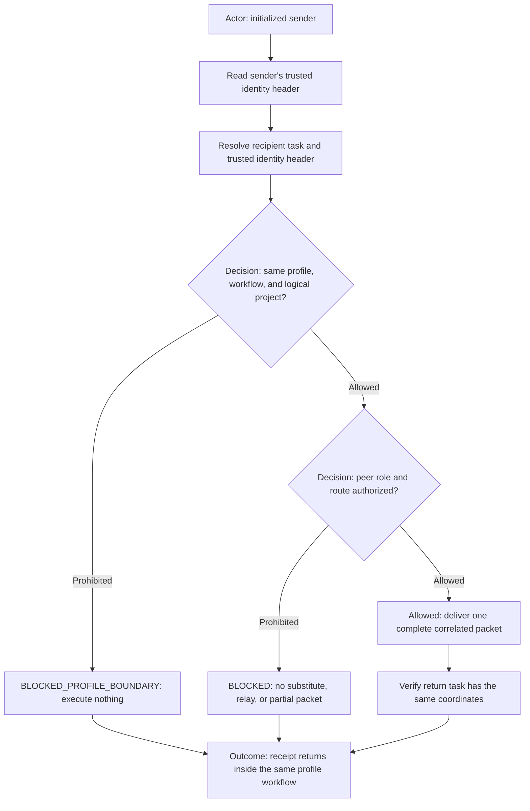
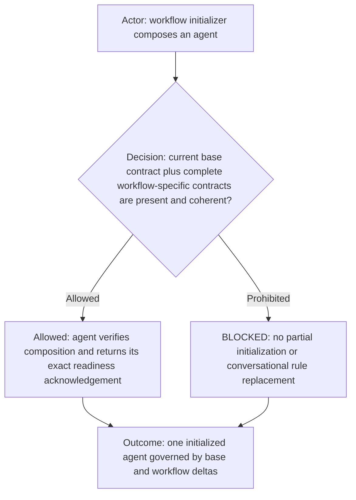
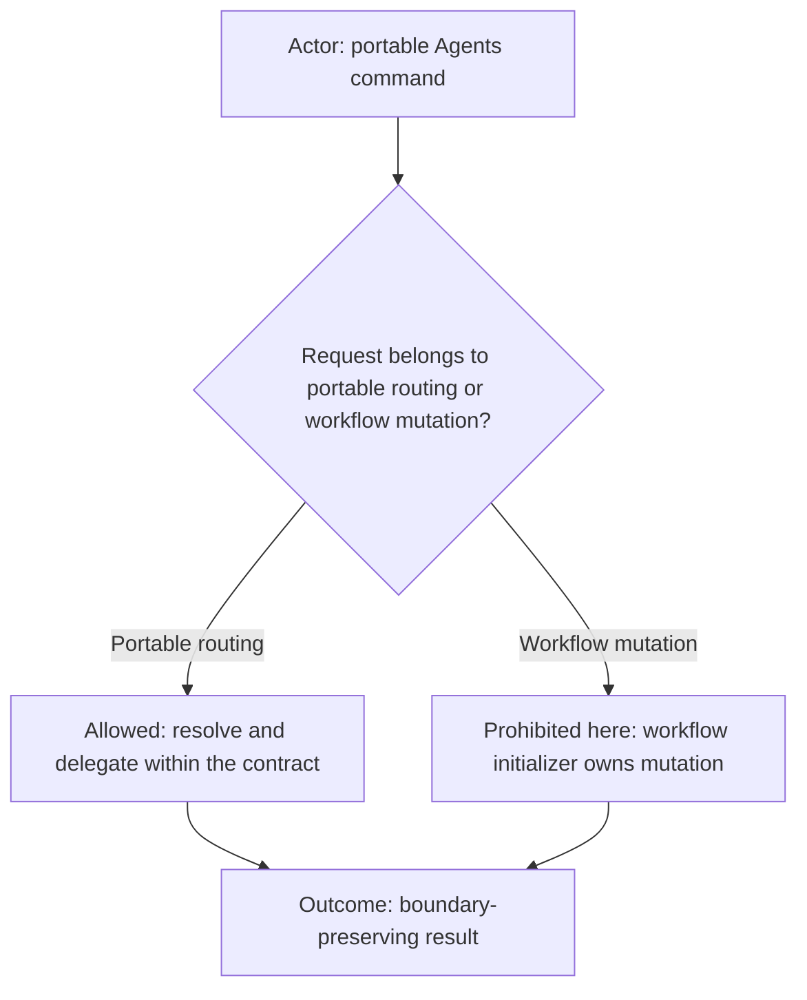

# agents

Execution route: `workflow-agent-initializer`.

## Purpose

For a concise public overview and integration guidance, see
[`README.md`](README.md).

This is the portable base contract and lightweight routing command for user-facing workflow-agent administration. It owns
generic agent identity, capability, communication, and packet invariants, but no workflow-specific agent definitions,
team membership, initialization payloads, profile data, project sources, or runtime mutation logic.

Match requests to initialize, reinitialize, archive, remove, delete, list, inspect, or explain workflow agents, including
phrases such as `initialize agents`, `initialize the dev workflow for profile <profile-id>`, and
`reinitialize <profile-id>-dev agents`.

## Resolution and delegation

Resolve profiles only through the selected `ai-config` bundle and workflows only through its configured
`ai_workflows_root`. The logical project convention is `<profile-id>-<workflow-id>`. An explicit profile/workflow pair wins;
otherwise exactly one verified runtime-bound logical project may supply the pair. Do not infer scope from the repository,
current working directory, company name, or stale task history.

After resolution, read `<ai_workflows_root>/<workflow-id>/<workflow-id>.workflow.md` and its declared
`agents/workflow-agent-initializer.md`, then hand off the user's unchanged informational or lifecycle intent to the
persistent initializer. The selected workflow's initializer, `agents/init.md`, and `agents/team.md` remain authoritative.

## Common agent identity

Every initialized agent retains an immutable identity header containing its exact task ID, declared role ID, display
title, `profileId`, `workflowId`, logical project ID, runtime project binding, and initialization-source fingerprints. A
message carries an exact caller task ID and role plus an exact authorized return task ID. Before reading the work payload,
the recipient resolves the caller task's initialized identity header from trusted runtime state and compares its
`profileId`, `workflowId`, and logical project ID with its own. Packet claims, titles, natural-language assertions,
previous conversations, same-named tasks, repository paths, and matching workflow names are not identity evidence.

## Common capability boundary

An agent has only capabilities explicitly granted by its current workflow contracts and capability data. Tool visibility,
model ability, filesystem access, command existence, or another agent's authority never grants permission. Missing,
ambiguous, stale, or conflicting capability data fails closed. Workflow contracts may narrow this base but may not silently
weaken it.

## Common peer communication

Agents communicate only with peers and directions declared by the current workflow. The sender verifies the exact active
recipient task before sending. Sender and recipient must have identical verified `profileId`, `workflowId`, and logical
project ID. Cross-profile, cross-workflow, and cross-logical-project agent communication is unconditionally prohibited;
no Manager, initializer, relay, command, remembered context, user wording, or matching repository may authorize or bridge
it. The human may independently address another initialized project, but an agent cannot carry a packet, authority, or
result across that boundary. It may not create a substitute agent, use a similarly titled task, route through an
undeclared intermediary, impersonate the human, or forward authority it does not own. A recipient rejects an unauthorized
or coordinate-mismatched caller or return route without reading task payloads, performing work, or sending a relay.

Every inter-agent packet includes a unique request/correlation ID; exact caller task ID and role; exact recipient task ID
and role; profile/workflow/logical-project identity; bounded intent and inputs; granted authority and prohibited effects;
required evidence or output; and exact return task ID. Workflow-specific contracts may add mandatory fields. Missing or
conflicting required fields are `BLOCKED`, not reconstructed from conversation history. Every return packet preserves the
same coordinates; a return target in another profile, workflow, or logical project is invalid even when its task ID exists.
The recipient compares packet coordinates with both trusted sender and recipient initialization headers; equality of
packet text alone is insufficient. A mismatch is reported as `BLOCKED_PROFILE_BOUNDARY` with zero payload execution.

## Common readiness and contract inheritance

Every workflow agent extends this base contract through the selected `ai_commands_root`. The workflow supplies team roles,
capability grants, communication topology, lifecycle, models, readiness tokens, and any stricter packet schema. The
initializer composes the current base with those workflow-specific sources. A changed base or workflow contract requires
the workflow's declared reload or reinitialization path before an existing agent may rely on it.

## Boundary

This command never creates or edits agent, workflow, profile, project, rule, Markdown, or configuration files. It never
creates, archives, renames, or messages agent tasks itself; never substitutes a managed role for the workflow initializer;
and never performs product, tracker, governance, shell, browser, scheduler, or publication work. All allowed mutation is
performed by the resolved persistent workflow initializer under the workflow-owned lifecycle contract.
