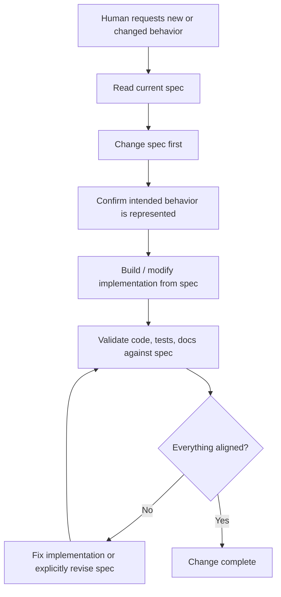
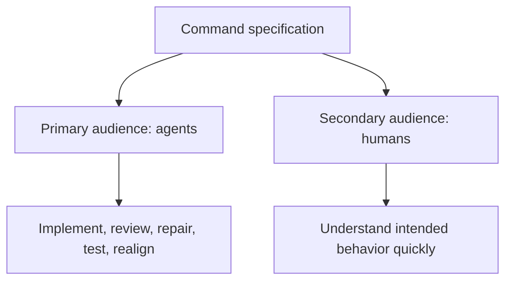
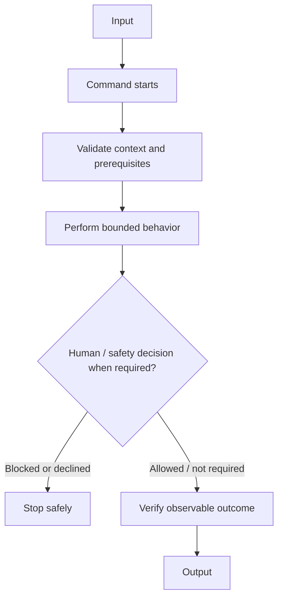

# <Command Name> — Specification

**Status: DRAFT**

This is the normative behavioral specification for the command. It is the source from which behavior is built, changed, reviewed, and validated. Keep it continuously synchronized with the intended behavior.

## Spec-driven development rule

This repository follows **spec-driven development (SDD)** for command behavior. When a human asks an agent to add, remove, or change command behavior, the agent must read and update the specification first, before modifying executable implementation.

Do not hack behavior directly into scripts or source code and document it afterward. A behavior change that is not represented in the specification is incomplete. The specification describes how the command is supposed to work now; Git history preserves previous behavior.

## Audience and reading model

The primary audience is an AI agent implementing, reviewing, repairing, testing, or extending the command. The secondary audience is a human reviewing it. A human should understand the complete idea from the first screen without needing to read the detailed agent-facing specification.

## Style and attitude

Write the specification as an executable behavioral contract, not an essay, tutorial, implementation diary, or marketing document.

- Lead with one compact **At a glance** Mermaid diagram.
- Immediately summarize **Input**, **Output**, **Execution**, and **Critical boundary**.
- Use precise `must`, `must not`, and `should` language.
- Prefer diagrams for flows, loops, states, interactions, and boundaries.
- Describe intended behavior independently of current implementation.
- Make missing inputs interactive and recoverable where appropriate.
- Separate authoritative sources from community/context sources.
- Define success through observable evidence.

## At a glance

**Input:** <required input/context>

**Output:** <observable result>

**Execution:** <how the command achieves the result>

**Critical boundary:** <human approval, trust, destructive action, external effect, or `None`>

## Scope

Define current behavior and explicit non-goals.

## Inputs

Define required/optional inputs, environment assumptions, connected resources, and recoverable missing-input states.

## Interaction / behavior

Define the primary flow, decisions, loops, human interactions, and blocked states.

## States

List meaningful execution states when interactive, resumable, long-running, or destructive.

## Safety invariants

Define authorization boundaries, prohibited behavior, trust boundaries, validation requirements, and fail-safe behavior.

## External sources / dependencies

Define authoritative sources, APIs, tools, protocols, and fallbacks.

## Completion criteria

Define observable evidence required before reporting success.

## Future scope

Record likely extensions without silently making them part of the current contract.
