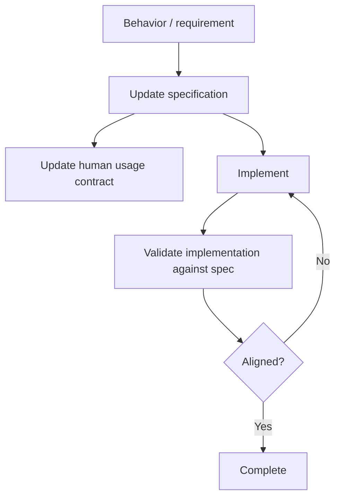

# <Command Name> — Specification

**Status: DRAFT**

This is the normative, agent-facing behavioral specification for the command. Keep it current as behavior changes.

## Source of truth

Describe how the command is supposed to behave independently of the current implementation. When implementation and specification disagree, surface the mismatch and resolve it deliberately.

## Scope

Define what this version of the command does and explicitly identify nearby behavior that is out of scope.

## Inputs

Define required and optional inputs, environment assumptions, connected resources, and recoverable missing-input states.

## Interaction / behavior

Use vertical Mermaid diagrams to define the primary flow, decisions, loops, human interactions, and blocked states.

## States

List meaningful execution states when the command is interactive, resumable, long-running, or destructive.

## Safety invariants

Define operations that require authorization, prohibited behavior, trust boundaries, validation requirements, and fail-safe behavior.

## External sources / dependencies

Define authoritative sources, APIs, tools, protocols, and fallback mechanisms. Distinguish authoritative sources from community/context sources.

## Completion criteria

Define observable evidence required before the command may report success.

## Future scope

Record likely extensions without silently making them part of the current contract.
