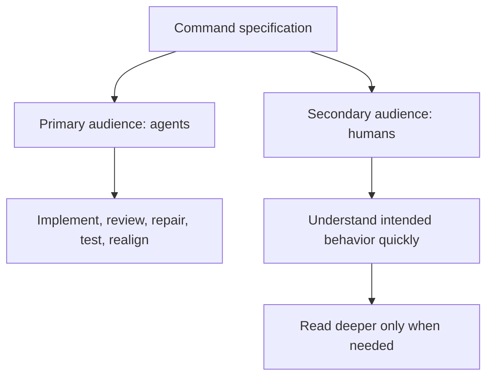
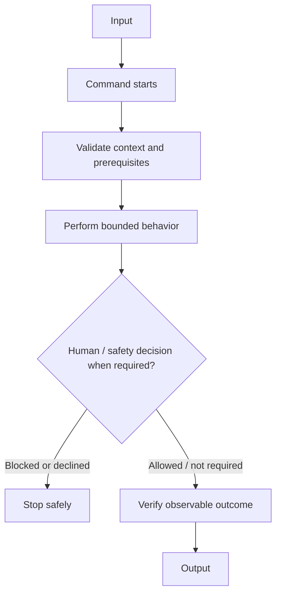
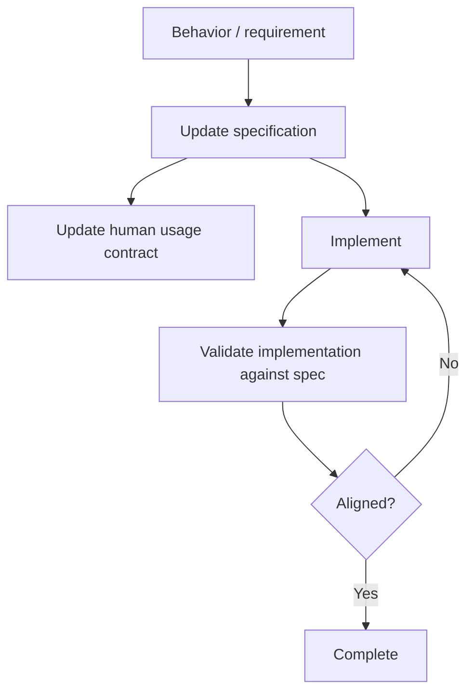

# <Command Name> — Specification

**Status: DRAFT**

This is the normative behavioral specification for the command. Keep it current as behavior changes.

## Audience and reading model

The **primary audience is an AI agent** implementing, reviewing, repairing, testing, or extending the command. Write precisely enough that an agent can determine what behavior is required, prohibited, incomplete, or out of alignment without reconstructing intent from the implementation.

The **secondary audience is a human** reviewing the command. A human should be able to open the specification, read the first screen, and understand what the command does, what goes in, what comes out, the major stages, and where human decisions are required. The human should not need to read the full specification unless reviewing details.

## Style and attitude

Write the specification as an **executable behavioral contract**, not as an essay, tutorial, implementation diary, or marketing document.

- Lead with one compact **At a glance** Mermaid diagram showing the complete happy path and important decision boundaries.
- Immediately summarize **Input**, **Output**, **Execution**, and any **critical human/safety boundary**.
- Use precise declarative language: `must`, `must not`, `should`, explicit states, observable evidence, and decision conditions.
- Prefer diagrams for flows, loops, interactions, state transitions, and boundaries; use prose for rules that need precision.
- Describe desired behavior independently of the current code. Do not document a bug merely because the implementation currently has it.
- Keep implementation details out unless they are part of the required architecture or trust/safety boundary.
- Make missing inputs interactive and recoverable where appropriate: say what the agent should ask the human to do next.
- Separate authoritative external sources from community/context material.
- Define success through observable evidence rather than an agent's assertion that work completed.
- Keep the top of the document simple enough for a human to scan; put exhaustive agent-facing detail below it.

## At a glance

**Input:** <smallest useful description of required input/context>

**Output:** <observable result>

**Execution:** <one sentence describing how the command achieves the result>

**Critical boundary:** <human approval, trust, destructive action, external effect, or `None`>

Everything below defines this overview precisely enough for an agent to implement and validate it.

## Source of truth

Describe how the command is supposed to behave independently of the current implementation. When implementation and specification disagree, surface the mismatch and resolve it deliberately.

## Scope

Define what this version of the command does and explicitly identify nearby behavior that is out of scope.

## Inputs

Define required and optional inputs, environment assumptions, connected resources, and recoverable missing-input states.

## Interaction / behavior

Use vertical Mermaid diagrams to define the primary flow, decisions, loops, human interactions, and blocked states.

## States

List meaningful execution states when the command is interactive, resumable, long-running, or destructive.

## Safety invariants

Define operations that require authorization, prohibited behavior, trust boundaries, validation requirements, and fail-safe behavior.

## External sources / dependencies

Define authoritative sources, APIs, tools, protocols, and fallback mechanisms. Distinguish authoritative sources from community/context sources.

## Completion criteria

Define observable evidence required before the command may report success.

## Future scope

Record likely extensions without silently making them part of the current contract.
