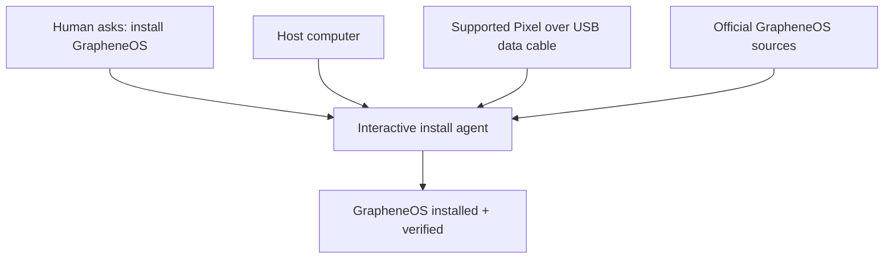
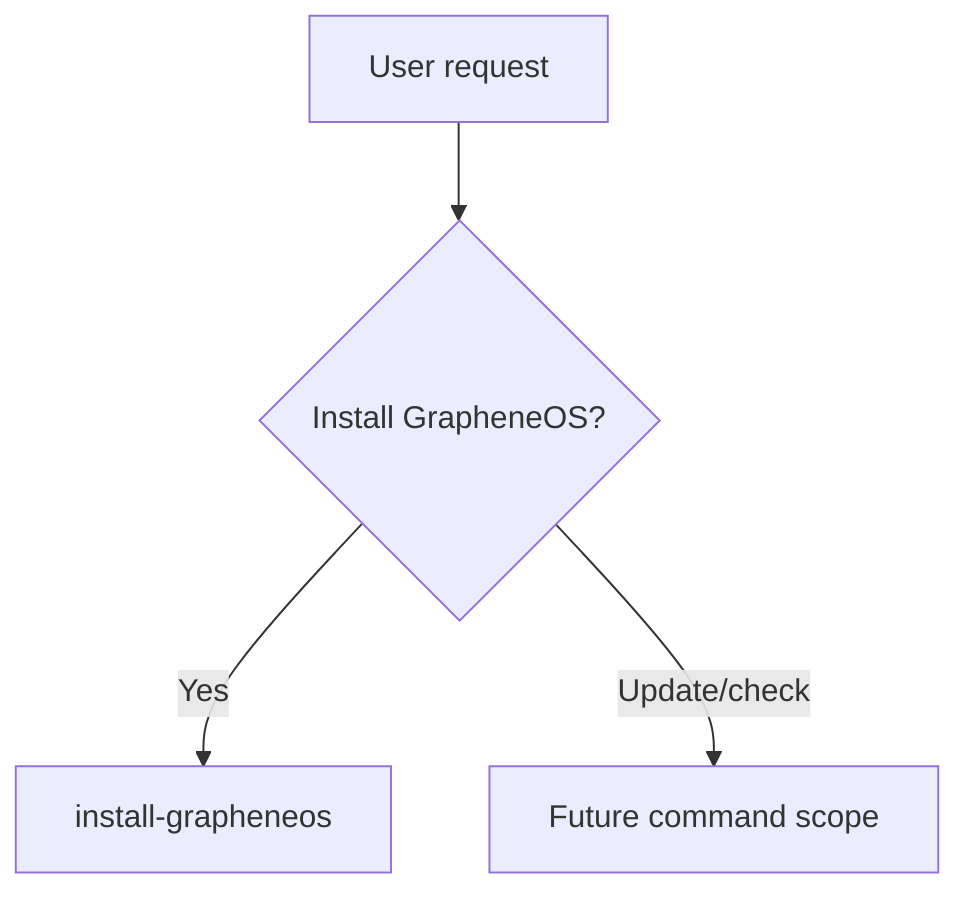
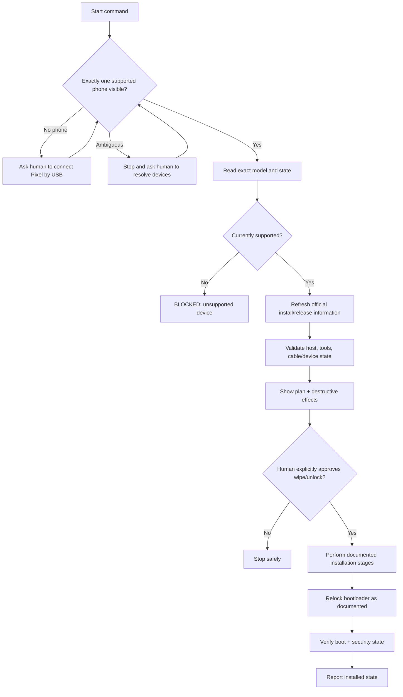
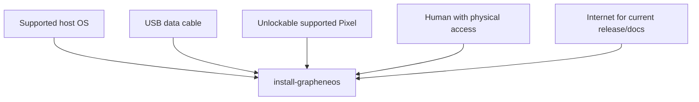
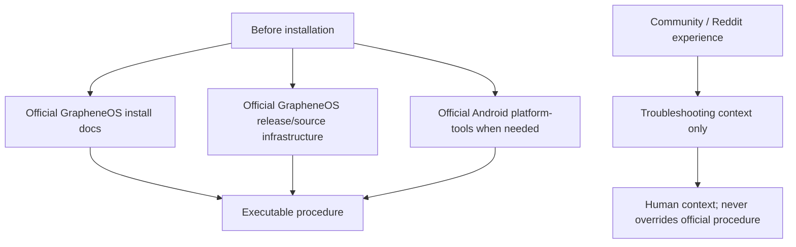
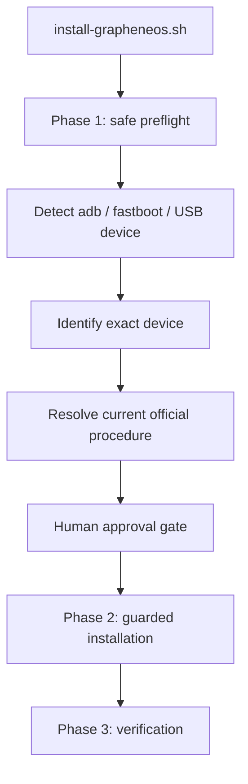
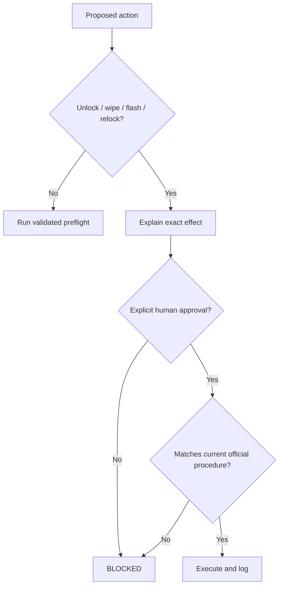
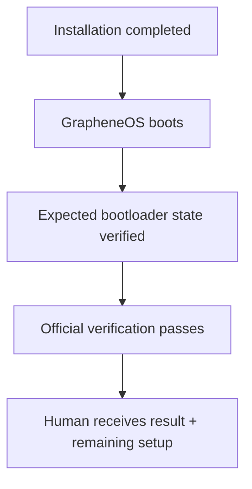

# Install GrapheneOS

**Status: DRAFT / PLACEHOLDER — do not treat this command as production-ready.**

Use `install-grapheneos` as an interactive agent-guided installation command for GrapheneOS on a supported Pixel.

For the human motivation, see [`WHY.md`](WHY.md). The normative behavior is defined by [`install-grapheneos.spec.md`](install-grapheneos.spec.md).

Because this command contains a `*.spec.md`, all behavior changes are governed by the [`sdd`](../../sdd/sdd.command.md) command: **change the specification first, then change implementation and validate alignment.** Whether the changed specification requires explicit human review before implementation is determined by the active workflow.

## Command boundary

The command coordinates the host computer, the physically connected phone, current official installation sources, and required human confirmations. The phone is an external device input, not merely a filesystem target.

**Initial installation requires a USB data connection. Bluetooth is not the installation transport.** The official GrapheneOS installation methods use a USB cable with WebUSB or command-line fastboot tooling.

## Intent

Map requests such as `install GrapheneOS`, `install GrapheneOS on this Pixel`, or `prepare this Pixel for GrapheneOS` to this command.

This draft covers **initial installation only**. Updating, auditing, repairing, or checking an existing GrapheneOS installation may later reuse the same device interaction model but are outside the current command contract.

## Interactive state machine

The command stays engaged with the human instead of failing immediately on a missing physical prerequisite. For example, when no phone is visible it should say what is missing, explain how to connect it, wait for the human to confirm, and then retry discovery.

A destructive boundary is different: the command must clearly explain the effect and obtain explicit approval before continuing.

## Expected input

Required inputs:

- a supported Pixel physically connected with a reliable **USB data cable**;
- a supported host computer running on bare metal;
- internet access on the host to retrieve current official instructions/releases;
- human physical access to the Pixel for device-side confirmations;
- explicit acceptance that bootloader unlocking / initial installation wipes existing device data.

Do not assume Bluetooth, Wi-Fi, or ordinary Android file-transfer pairing is sufficient for flashing the operating system.

## Source-of-truth policy

The committed Markdown describes the interaction contract, not a frozen copy of installation commands. At execution time, the agent must validate the current official procedure because supported devices, releases, hashes and tool versions change.

Primary references:

- [GrapheneOS Web installer](https://grapheneos.org/install/web) — recommended installation path for most users and the canonical WebUSB flow.
- [GrapheneOS CLI install guide](https://grapheneos.org/install/cli) — canonical command-line procedure and the best basis for future agent automation.
- [GrapheneOS GitHub organization](https://github.com/GrapheneOS) — public project source and repositories.
- [GrapheneOS website installer source](https://github.com/GrapheneOS/grapheneos.org/blob/main/static/install/web.html) — implementation/source for the official web installer page.
- [Android SDK Platform Tools](https://developer.android.com/tools/releases/platform-tools) — official source for adb/fastboot tooling.

Community context (non-authoritative):

- [GrapheneOS Reddit: installing from another Android device](https://www.reddit.com/r/GrapheneOS/comments/1vhngi0/no_pc_no_problem/) — useful demonstration that the WebUSB installation model is fundamentally device + USB + installer, not traditional desktop file copying.

Community material may help explain real-world issues but must never override the official GrapheneOS procedure.

## Implementation strategy

Implement incrementally:

1. **Preflight first:** host OS, free disk, network, platform-tools availability/version, connected-device discovery and exact model/state. No mutation.
2. **Interactive recovery:** when a prerequisite is missing, print a precise human action and expose a retry/continue state rather than guessing.
3. **Current-source resolution:** retrieve/validate current GrapheneOS device support, release and official procedure before constructing the execution plan.
4. **Plan preview:** show exact detected device, selected release, required destructive stages and verification plan.
5. **Human gate:** explicit approval before unlocking/wiping/flashing.
6. **Guarded execution:** follow the official CLI procedure without skipping, reordering, or inventing steps.
7. **Verification:** confirm bootloader/security state and successful GrapheneOS boot using the official verification guidance.

The official Web installer is currently recommended for most humans. For an AI command, the CLI procedure is the more natural automation foundation because each operation can be inspected, logged and gated. The command may still choose to guide the human through the official Web installer when that is safer than automating a particular stage.

## Safety contract

- Never guess the connected device model.
- Never continue when the device is unsupported or identity is ambiguous.
- Never treat Bluetooth pairing as authorization to flash a device.
- Use current official GrapheneOS instructions as execution source of truth.
- Verify downloaded artifacts using the current official verification procedure.
- Stop before bootloader unlocking, data wiping, flashing, locking/relocking, or another irreversible boundary and obtain explicit human approval.
- Never bypass device security protections to make installation easier.
- Never continue after a verification mismatch.
- Preserve a clear execution log and final verification result.

## Completion

Complete only when the exact device and installed OS are verified, the expected bootloader/security state is confirmed, and the human receives a concise installation report. Privacy configuration after first boot can be added as a subsequent stage/command once the installation path itself is proven.

## Tags

`#command` `#ai-command` `#install` `#android` `#pixel` `#grapheneos` `#privacy` `#device-provisioning` `#interactive` `#sdd`
