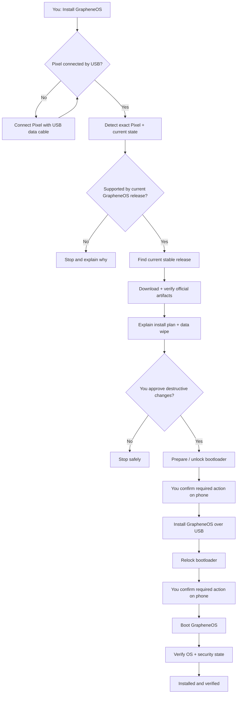
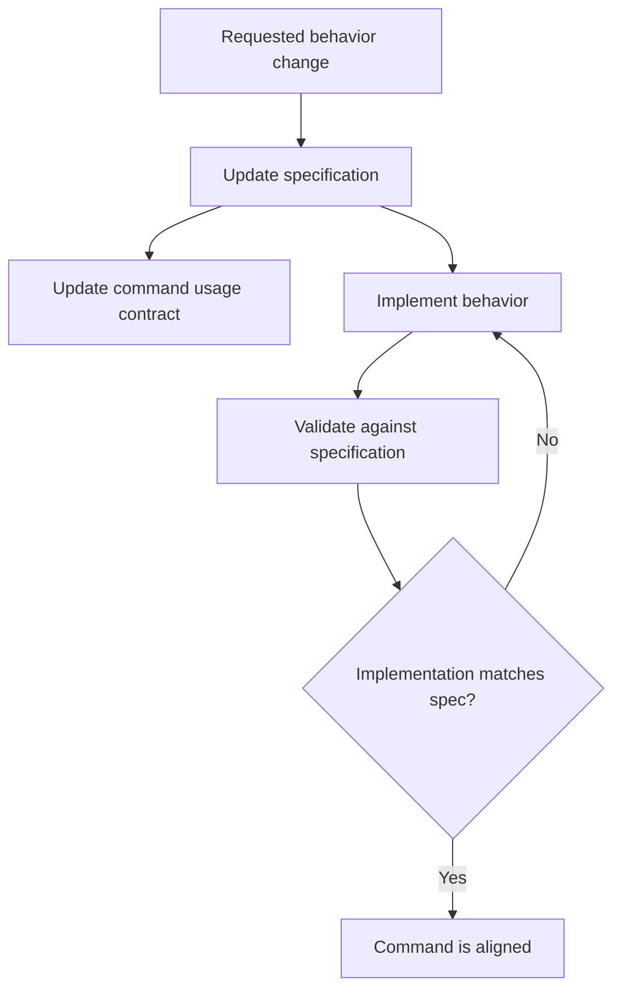
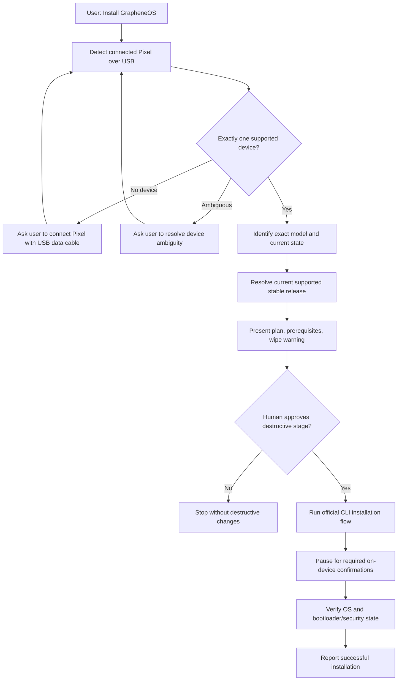
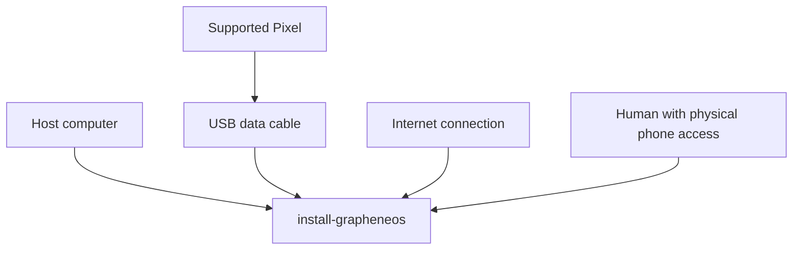
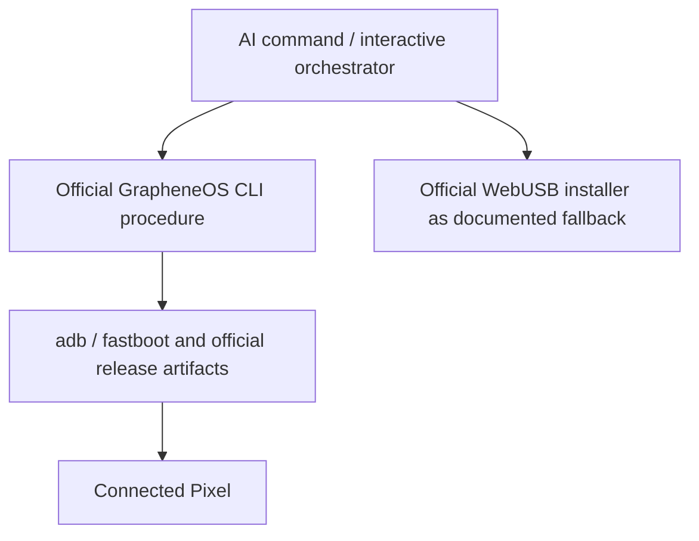
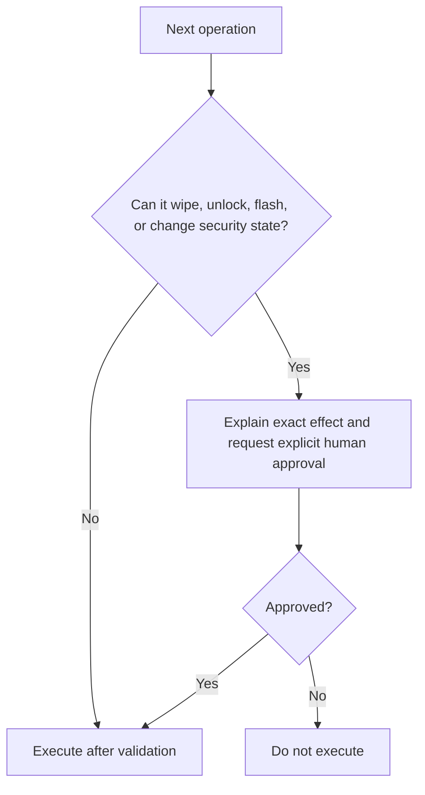
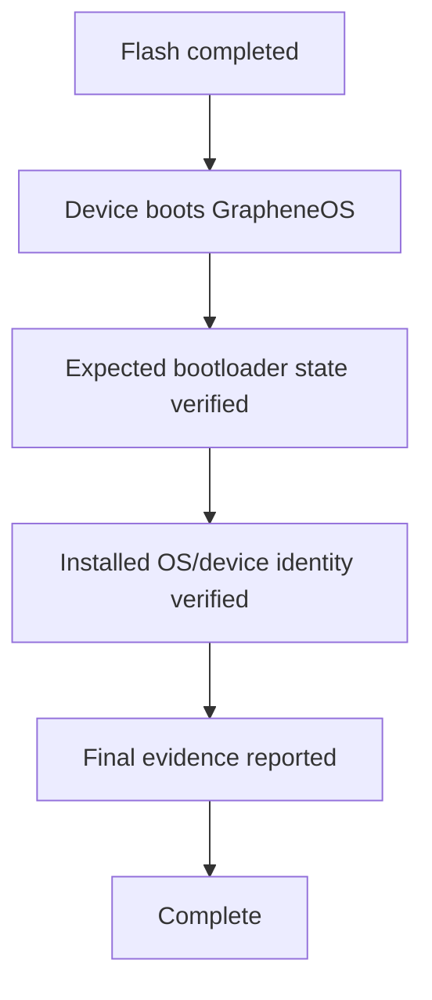

# Install GrapheneOS — Specification

**Status: DRAFT**

This file is the normative behavioral specification for the `install-grapheneos` command. It is primarily for agents implementing, reviewing, repairing, or extending the command, but it should also let a human understand the complete behavior at a glance.

## At a glance

**Input:** supported Pixel + USB data cable + host computer + internet + human available for confirmations.

**Output:** verified GrapheneOS installation with the expected locked/security state.

**Execution:** agent orchestrates the official GrapheneOS CLI procedure; the official WebUSB installer is the human-facing fallback.

**Critical boundary:** the agent may automate safe checks and mechanical work, but must stop and obtain explicit human approval before destructive/security-sensitive operations and must wait for physical confirmations required on the phone.

Everything below defines this overview precisely enough for an agent to implement and validate it.

## Source of truth

Behavior is specified here before or together with implementation. When code and this specification disagree, treat the mismatch as a defect and resolve it deliberately; do not silently redefine behavior from the current implementation.

## Scope

Version 1 covers **initial GrapheneOS installation only**. Updating an already-installed GrapheneOS device, ongoing administration, backup/restore, and general Android management are future capabilities and must not be inferred into this implementation.

## Primary interaction

The command is interactive. Missing prerequisites are recoverable states whenever possible. The agent should explain the next concrete action, wait for the human, re-check state, and continue from the last verified stage.

## Inputs

Required inputs:

- host computer supported by the implementation;
- direct USB data connection to the Pixel;
- exactly one intended supported Pixel, or explicit disambiguation;
- internet access for current documentation/release retrieval;
- human physically available for phone-side actions and approvals;
- acknowledgement that bootloader unlocking / installation can erase user data.

Bluetooth is not an installation transport for this command.

## Execution adapter

The primary agent-oriented implementation uses the official GrapheneOS CLI installation procedure because it is scriptable and observable. The official WebUSB installer remains a supported human-facing fallback rather than logic that this project reimplements.

The command must consult current official GrapheneOS documentation at execution/development time rather than freezing volatile release URLs or device support assumptions into the specification.

## State requirements

The implementation must represent or be able to reconstruct these stages:

1. `waiting-for-device`
2. `device-detected`
3. `device-validated`
4. `prerequisites-validated`
5. `release-resolved`
6. `awaiting-destructive-approval`
7. `bootloader-prepared`
8. `release-verified`
9. `flashing`
10. `awaiting-device-confirmation`
11. `bootloader-relocked`
12. `installation-verified`
13. `complete`

A restart should prefer re-detecting real device state over trusting stale local state.

## Safety invariants

The command must never:

- guess a device model;
- flash an image for a different device;
- use an unverified release artifact;
- silently unlock or relock a bootloader;
- silently cross a data-wipe boundary;
- bypass Pixel/GrapheneOS security protections;
- claim success without verifying the resulting device state.

## Release resolution

The command must determine the currently supported stable GrapheneOS release appropriate for the detected device from authoritative GrapheneOS sources. It must not assume that a version recorded when this repository was authored is still current.

Before flashing, the implementation must perform the artifact/signature verification required by the current official GrapheneOS CLI procedure.

## Human interaction contract

Prompts must describe **what the user needs to do next**, not merely report an error.

Examples:

- `No Android device detected. Connect your Pixel directly with a USB data cable, unlock the screen if needed, then tell me to continue.`
- `I detected Pixel <model>. The next stage requires bootloader unlocking and will erase the phone. Continue?`
- `The phone is waiting for physical confirmation. Approve the highlighted bootloader action on the Pixel, then tell me when it is complete.`

After each human action, re-detect state before continuing.

## Completion criteria

The command is complete only when observable evidence confirms the expected GrapheneOS installation and required bootloader/security state. A completed flashing process alone is not sufficient.

## Future scope

Future specifications may add `update`, `inspect`, `privacy-audit`, backup/restore, or broader Android device administration. They must be added explicitly rather than changing the meaning of this installation specification implicitly.
