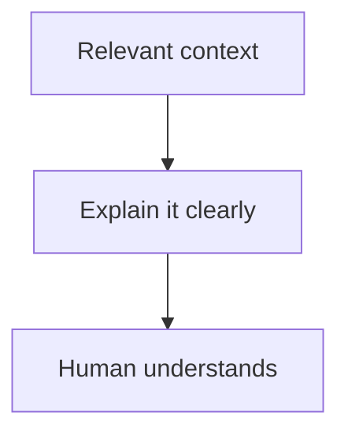
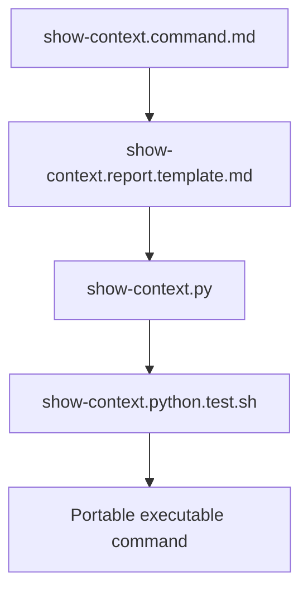
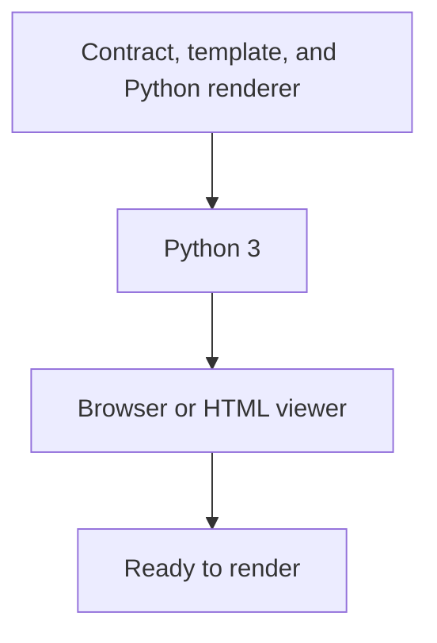
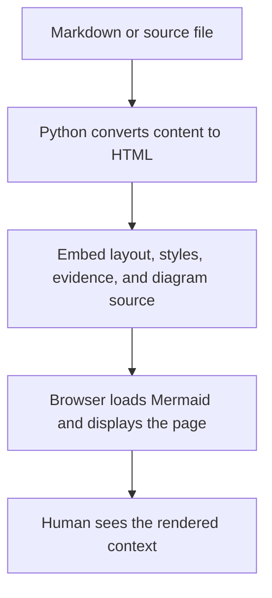
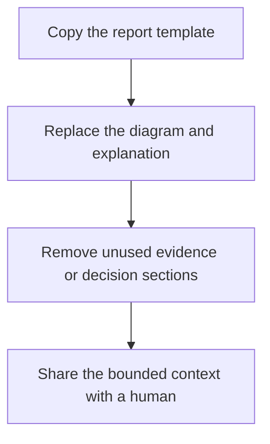

# Show Context



**Use `show-context` to explain relevant context to a human.**

It is a generic presentation command for turning bounded evidence
into a human-readable report. It is useful on its own and as the presentation
layer of code review, investigation, handoff, architecture, and testing flows.

**Usually:** inspect relevant folders, source material, conversation history,
summaries, or reports; select what matters; then present it in the form a human
can understand most easily. Connect the command to the human-facing agent that
has access to—and responsibility for—the relevant knowledge. The
[`agents` command](../agents/README.md) explains the shared identity,
capability, context-boundary, and communication rules for that connection.

## Published package



- [`show-context.command.md`](show-context.command.md) defines intent, mapping,
  report structure, safety boundaries, and completion.
- [`show-context.report.template.md`](show-context.report.template.md) is a
  visual-first starting point for reports.
- `show-context.py` renders the report as browser-readable HTML using Python's
  standard library.
- `show-context.python.test.sh` verifies the portable renderer.

This public extraction includes the portable renderer but excludes private
project discovery, session state, meeting-folder conventions, and launcher
integration.

## Prerequisites



The published executable requires Python 3 and a browser or HTML viewer. It uses
only the Python standard library. Pygments is optional and improves code colors;
without it, code remains escaped and readable. Mermaid loads from a public CDN
when network access is available, and diagram source remains readable without
it. No command-specific installer is required.

## How rendering works



The render logic lives in `show-context.py`; there are no prebuilt report files.
It reads the source, converts supported Markdown and code blocks to HTML, embeds
the page layout and CSS, writes one standalone HTML artifact, prints its path,
and opens it with the system browser unless `--no-open` is supplied. Mermaid is
rendered inside that page by the browser when the public CDN is reachable.

Without `--output`, a source such as `review.md` produces `review.md.html` beside
the source. Use `--output <path>` to place generated reports in a temporary,
ignored, or command-owned output folder. Generated HTML is runtime output and
should not be committed.

## Quick start



Start with the template, answer one question, lead with the smallest useful
visual, and include only evidence that supports understanding.

```bash
python3 show-context.py \
  --file show-context.report.template.md \
  --title "Review context" \
  --request "What should the human understand?"
```
