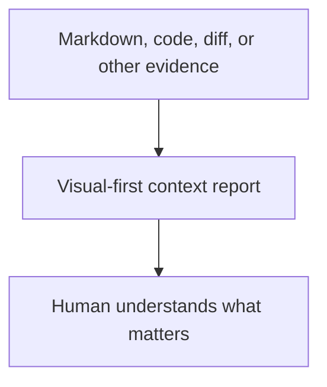
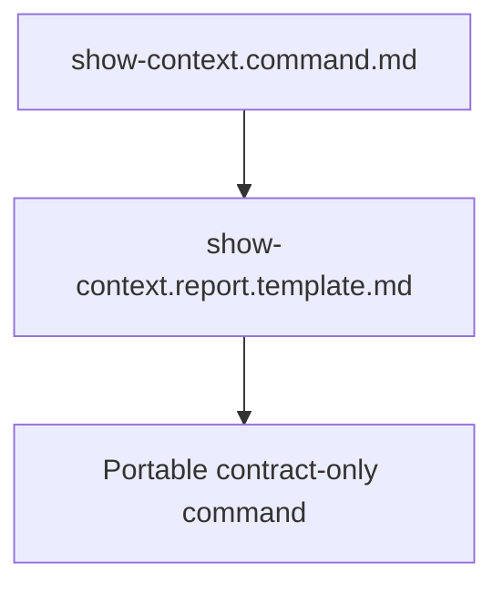
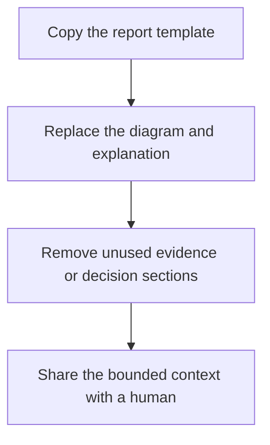

# Show Context

`show-context` is a generic presentation command for turning bounded evidence
into a human-readable report. It is useful on its own and as the presentation
layer of code review, investigation, handoff, architecture, and testing flows.

## Published package

- [`show-context.command.md`](show-context.command.md) defines intent, mapping,
  report structure, safety boundaries, and completion.
- [`show-context.report.template.md`](show-context.report.template.md) is a
  visual-first starting point for reports.

This public extraction is intentionally contract-only. A host may render the
Markdown with its own browser, IDE, or report surface. Executable and local
discovery adapters can be added without changing the command contract.

## Quick start

Start with the template, answer one question, lead with the smallest useful
visual, and include only evidence that supports understanding.
