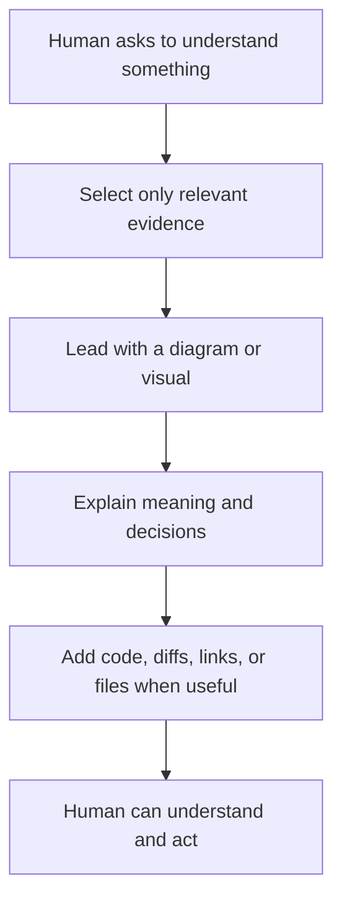
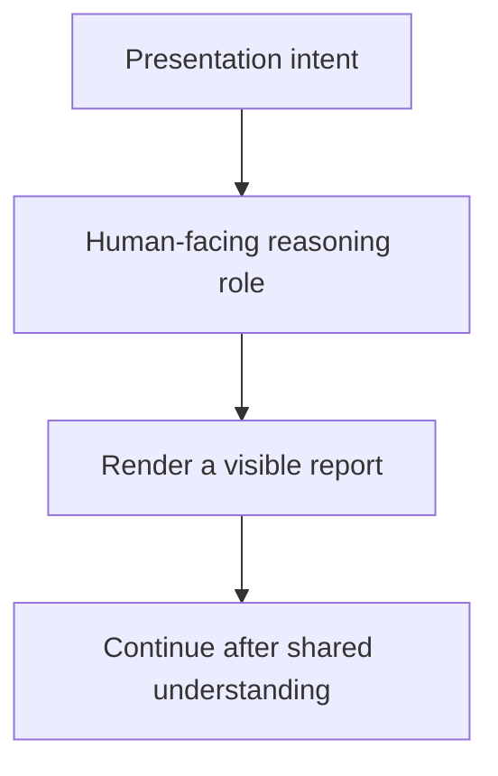
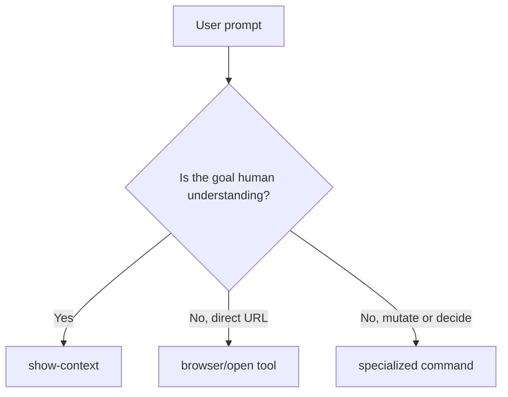
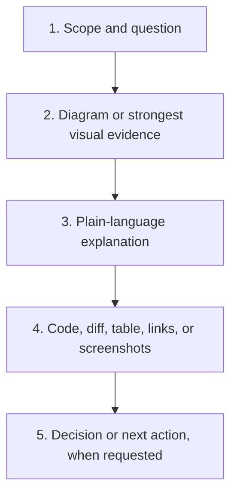
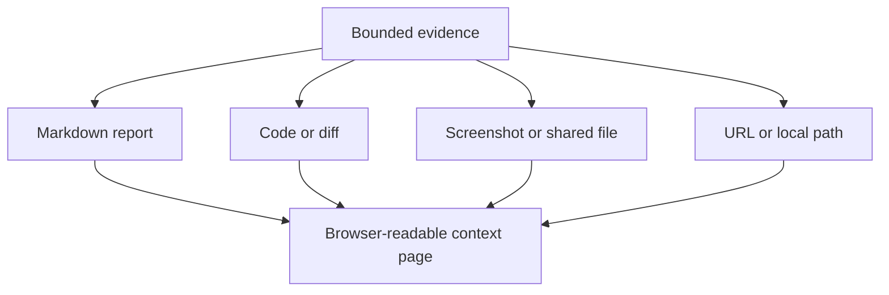
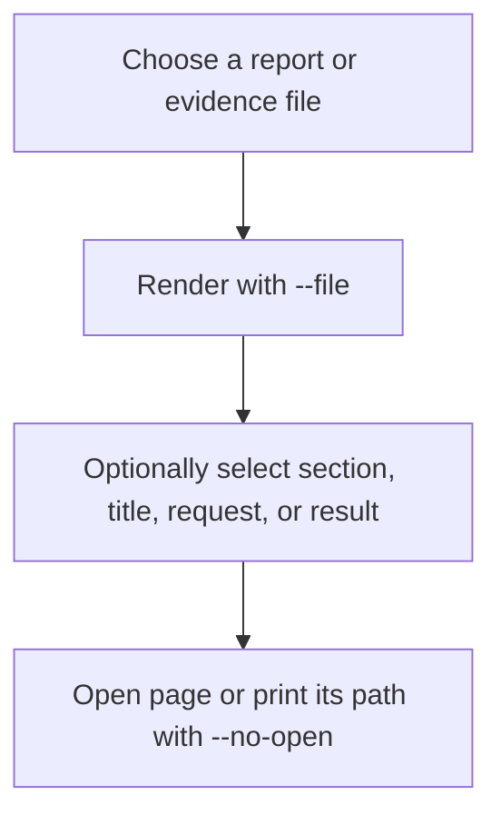
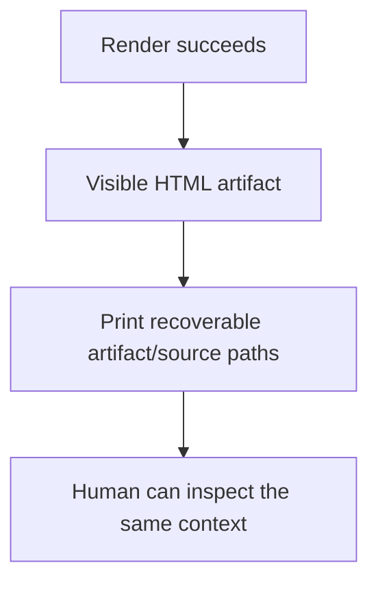
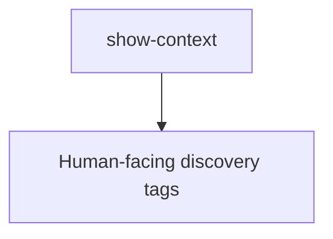

# Show Context



Use `show-context` to turn bounded evidence into a human-readable visual report.
It is a low-level presentation command: other commands and workflows may compose
it for code review, investigation, handoff, manual testing, architecture, or any
other situation where a person needs to understand context before acting.

The command presents evidence; it does not decide approval, modify the subject,
or replace a specialized review command.

## Execution role



- Route to a human-facing reasoning or review role.
- Do not delegate presentation-only work to an execution-only role.
- A composing command remains responsible for its own domain decisions.

## Intent mapping



Map requests such as “show the context,” “prepare a report,” “walk me through
it,” “show the code review context,” or “show the diagram, screenshots, diff, or
evidence” when the intended outcome is visible understanding.

Use a direct browser or file-opening tool when the user only wants an item
opened. Use a specialized command when the user asks for a decision, mutation,
or domain-specific procedure; that command may call `show-context` for its
human-visible result.

## Report contract



Every generated report should:

- answer one bounded human question;
- lead with the smallest useful visual, normally a vertical Mermaid diagram;
- explain what the visual means before exposing implementation detail;
- include only evidence that changes understanding or supports a claim;
- preserve source paths or links so evidence can be inspected;
- clearly distinguish facts, inferences, risks, and recommended actions;
- omit code when code is irrelevant, and use focused snippets instead of dumps;
- avoid secrets, credentials, private configuration, and unrelated context.

Use [`show-context.report.template.md`](show-context.report.template.md) as the
portable starting point. Delete unused sections rather than filling space.

## Presentation modes



The executable can render Markdown, text, and source files; select one Markdown
section; render Mermaid; highlight code and diffs; preview shared images; and
open explicitly supplied URLs or local paths. Project discovery and local drop
folders are optional integrations, not part of the portable report contract.

## Usage



```bash
./show-context.command.sh \
  --file <report-or-source-file> \
  --title "Context title" \
  --request "Question being answered"

./show-context.command.sh \
  --file <markdown-file> \
  --section "Review Context" \
  --no-open

./show-context.command.sh --see latest
./show-context.command.sh --url <url>
./show-context.command.sh --path <local-path>
```

Optional local integrations also support `--project`, `--project-dir`,
`--feature`, `--output-dir`, `--open-links`, `--see-dir`, and repeated `--url`
or `--path` values. Run `./show-context.command.sh --help` for the exact local
interface.

## Output and completion



Completion requires a readable artifact, recoverable location, faithful source
links, and no silent mutation of the material being presented. If the available
evidence cannot answer the question, say what is missing instead of producing a
confident but ungrounded report.

## Tags



`#command` `#ai-command` `#show-context` `#human-context` `#visual-report`
`#code-review` `#evidence`
