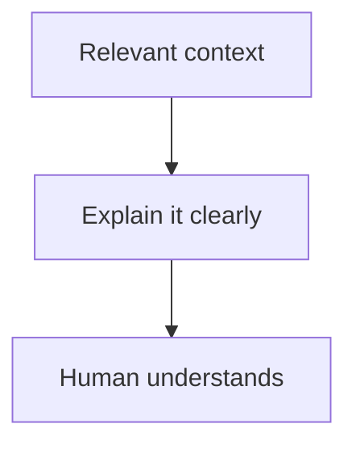
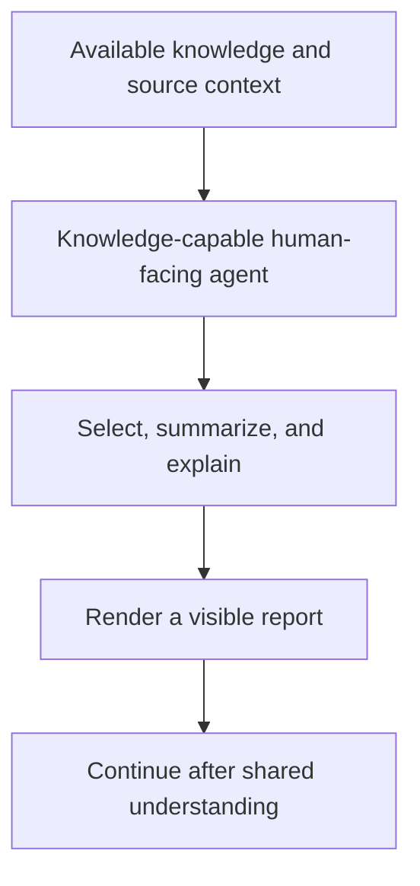
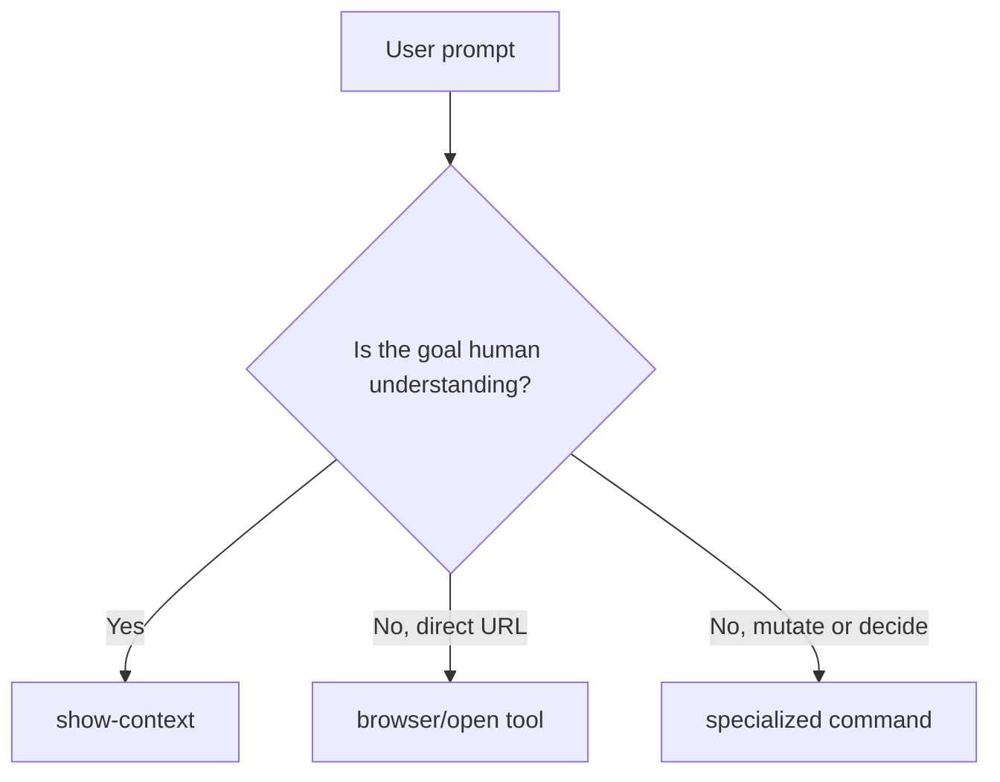
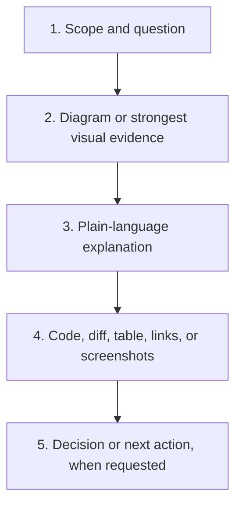
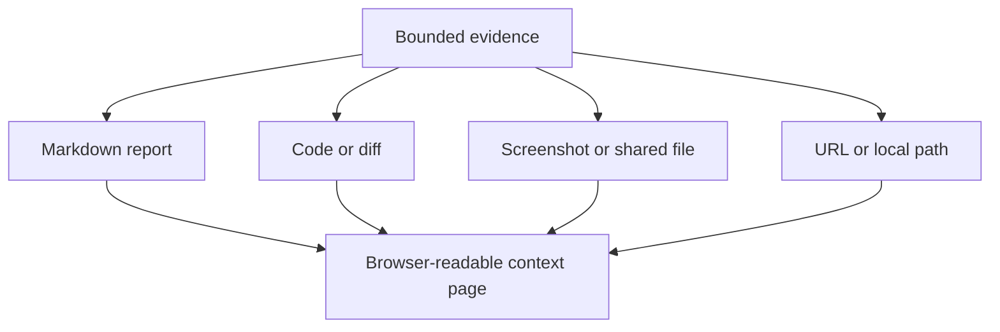
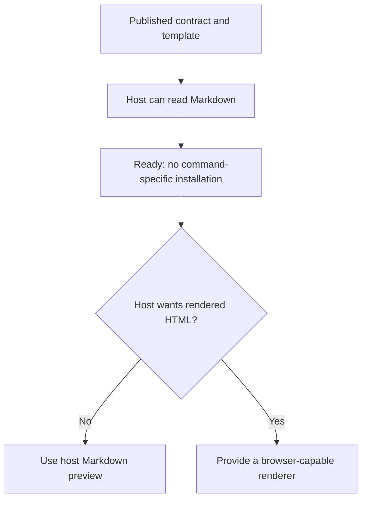
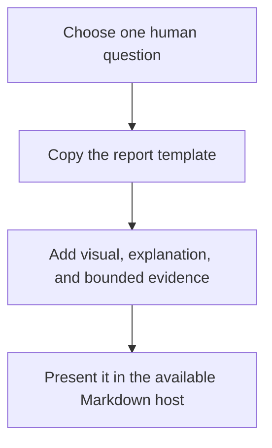
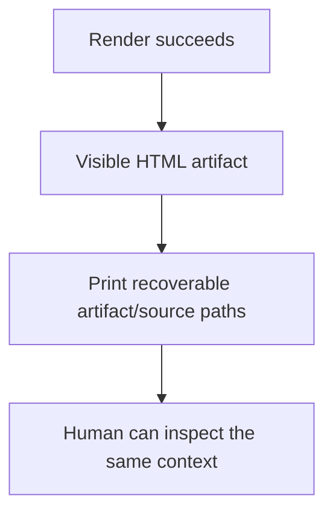
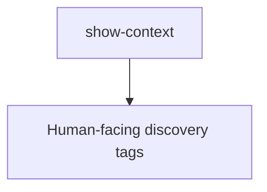

# Show Context

**Use `show-context` to explain relevant context to a human.**

It turns bounded evidence into a human-readable visual report.
It is a low-level presentation command: other commands and workflows may compose
it for code review, investigation, handoff, manual testing, architecture, or any
other situation where a person needs to understand context before acting.

**Usually:** inspect relevant folders, source material, conversation history,
summaries, or reports; select what matters; then present it in the form a human
can understand most easily.

Start with what the person needs to understand. Then show the smallest useful
visual, explain what it means, and add code or other evidence only when it helps.
The command presents evidence; it does not decide approval, modify the subject,
or replace a specialized review command.

## Execution role

- Route to the human-facing agent responsible for the relevant knowledge. Use
  the [`agents` command](../agents/agents.command.md) to define and validate that
  agent's identity, capabilities, context boundary, and communication rules.
- Give that agent access to the bounded folders, source material, conversation
  history, summaries, or reports needed to answer the human's question.
- Do not delegate presentation-only work to an execution-only role.
- A composing command remains responsible for its own domain decisions.

`show-context` defines how context is selected and presented; it does not make a
weakly informed agent knowledgeable. Report quality depends on the connected
agent's reasoning capability, its access to the right sources, and the quality
of the surrounding context. If knowledge is missing, the agent must identify the
gap rather than invent an explanation.

## Intent mapping

Map requests such as “show the context,” “prepare a report,” “walk me through
it,” “show the code review context,” or “show the diagram, screenshots, diff, or
evidence” when the intended outcome is visible understanding.

Use a direct browser or file-opening tool when the user only wants an item
opened. Use a specialized command when the user asks for a decision, mutation,
or domain-specific procedure; that command may call `show-context` for its
human-visible result.

## Report contract

Every generated report should:

- answer one bounded human question;
- lead with the smallest useful visual, normally a vertical Mermaid diagram;
- explain what the visual means before exposing implementation detail;
- include only evidence that changes understanding or supports a claim;
- preserve source paths or links so evidence can be inspected;
- clearly distinguish facts, inferences, risks, and recommended actions;
- omit code when code is irrelevant, and use focused snippets instead of dumps;
- avoid secrets, credentials, private configuration, and unrelated context.

Use [`show-context.report.template.md`](show-context.report.template.md) as the
portable starting point. Delete unused sections rather than filling space.

## Presentation modes

A host-provided renderer may render Markdown, text, and source files; select one
Markdown section; render Mermaid; highlight code and diffs; preview shared
images; and open explicitly supplied URLs or local paths. Project discovery and
local drop folders are optional integrations, not part of the portable report
contract.

## Prerequisites

The published contract-only command requires only a host that can read Markdown.
GitHub, an IDE Markdown preview, or an AI environment with Mermaid support may
display the diagrams directly. No command-specific installer is required.

An optional executable renderer should declare and check its own dependencies.
A typical implementation needs a browser or HTML viewer and a general-purpose
runtime such as Python. Mermaid and syntax highlighting may be bundled for
offline use or loaded from a documented public CDN. An unavailable optional
highlighter should reduce formatting quality, not prevent the report from being
read. Installation must require the user's authorization and must not assume an
operating system, package manager, profile, organization, or local directory.

## Usage

Copy `show-context.report.template.md`, replace its placeholder diagram and
explanation, remove unused sections, and present the resulting Markdown using
the host's normal preview or browser surface. A future executable adapter may
automate this flow, but its interface is not part of this contract-only release.

## Output and completion

Completion requires a readable artifact, recoverable location, faithful source
links, and no silent mutation of the material being presented. If the available
evidence cannot answer the question, say what is missing instead of producing a
confident but ungrounded report.

## Tags

`#command` `#ai-command` `#show-context` `#human-context` `#visual-report`
`#code-review` `#evidence`
