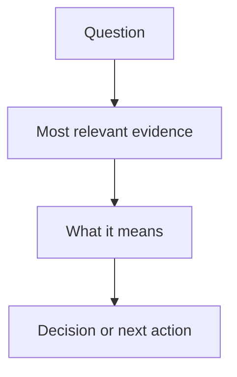
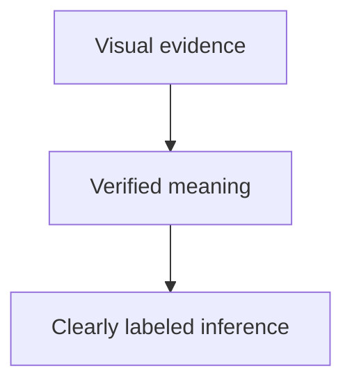
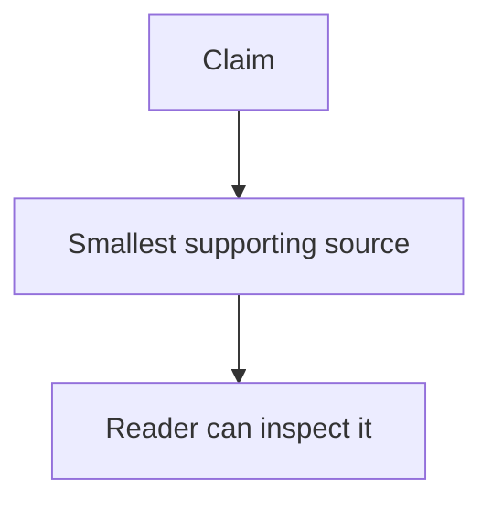
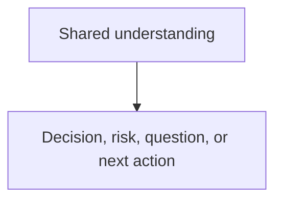

# Context Report: <question or subject>



State in one or two sentences what the reader should understand from this
report.

## What the visual shows



Explain the important relationship, sequence, or decision shown above. Separate
verified facts from inference.

## Evidence



Use the smallest useful combination of a table, screenshot, diff, link, or code
snippet. Include source locations. Remove this section if the visual and
explanation are sufficient.

```text
Focused evidence only; do not paste unrelated output.
```

## Decision or next action



State the decision, risk, open question, or next action when the user asked for
one. Otherwise remove this section.
